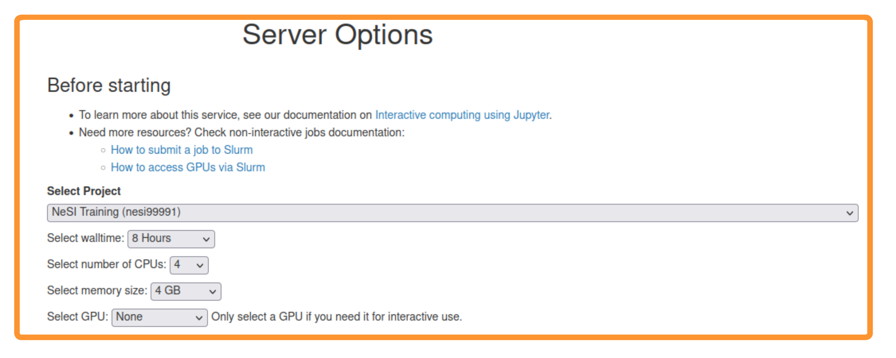

# 02 - Setup

<p style="text-align:left;">
  <b><a class="btn" href="https://nesi.github.io/snakemake_workshop/workshop_material/01_introduction.html" style="background: var(--bs-green);font-weight:bold">&laquo; 1-Introduction</a></b> 
  <span style="float:right;">
    <b><a class="btn" href="https://nesi.github.io/snakemake_workshop/workshop_material/03_create_a_basic_workflow.html" style="background: var(--bs-green);font-weight:bold">3 - Creating a Basic WF &raquo;</a></b>
  </span>
</p>


# Table of contents

- [02 - Setup](#02---setup)
- [Table of contents](#table-of-contents)
  - [Setup for running on NeSI](#setup-for-running-on-nesi)
    - [Connect to Jupyter on NeSI](#connect-to-jupyter-on-nesi)
    - [Setting up Miniconda on NeSI](#setting-up-miniconda-on-nesi)
    - [Create a conda environment on NeSI](#create-a-conda-environment-on-nesi)
  - [Setup for running on your machine](#setup-for-running-on-your-machine)
    - [Install Miniconda](#install-miniconda)
      - [Check your OS](#check-your-os)
      - [Installing miniconda](#installing-miniconda)
    - [Create a conda environment](#create-a-conda-environment)
  - [Clone this repo](#clone-this-repo)


## Setup for running on NeSI

Choose between this section and [Setup for running on your machine](#setup-for-running-on-your-machine) (don't do both).

### Connect to Jupyter on NeSI

1. Follow [https://jupyter.nesi.org.nz/hub/login](https://jupyter.nesi.org.nz/hub/login)
2. <p>Enter NeSI username, HPC password and 6 digit second factor token (as set on <a href="https://my.nesi.org.nz/account/hpc-account">MyNeSI</a>)<br></p>
3. <p>Choose server options as below<br></p>
4. <p>Start a terminal session from the JupyterLab launcher<br></p>

When you connect to NeSI JupyterLab you always start in a new hidden directory. To make sure you can find your work next time, you should change to another location. Here we will switch to our project directory, since home directories can run out of space quickly. If you are using your own project use that instead of "nesi99991".

```bash
mkdir -p /nesi/project/nesi99991/snakemake20210914/$USER
cd /nesi/project/nesi99991/snakemake20210914/$USER
```

You can also navigate to the above directory in the JupyterLab file browser, which can be useful for editing files and viewing images and html documents.

### Setting up Miniconda on NeSI

We will now configure conda. Note that this will change your existing conda configuration if you already have one. In that case, we recommend you rename your current conda configuration file (`mv ~/.condarc ~/.condarc.bkp`) and then restore it after the workshop (`mv ~/.condarc.bkp ~/.condarc`).

On NeSI we have lots of software preinstalled to simplify things for our users. To load Miniconda run the following in the terminal:

```bash
module purge
module load Miniconda3
source $(conda info --base)/etc/profile.d/conda.sh
```

Next, [set up your channels](https://bioconda.github.io/user/install.html#set-up-channels) (channels are locations where packages/software are can be installed from)

```bash
conda config --add channels defaults
conda config --add channels bioconda
conda config --add channels conda-forge
```

To save your [home storage](https://support.nesi.org.nz/hc/en-gb/articles/360000177256-NeSI-File-Systems-and-Quotas), configure an alternative storage for the downloaded packages

```bash
conda config --add pkgs_dirs /nesi/nobackup/nesi99991/conda_pkgs/$USER
```

Note that the above uses the nesi99991 (training project) nobackup directory for the package cache. After this workshop you can change this to your own project by editing `~/.condarc`.

Change the default conda prompt to the environment name (the default prompt would include the entire directory path)

```bash
conda config --set env_prompt '({name})'
```

### Create a conda environment on NeSI

With Miniconda, we can create a conda environment which acts as a space contained from the rest of the machine in which our workflow will automatically install all the necessary software it uses, supporting the portability and reproducibility of your workflow.

Create a conda environment (called `snakemake_env`) that has Snakemake installed (and all it's dependant software). The `--prefix snakemake_env` argument tells conda to create the environment within the current directory rather than the default which would be in your home directory (on NeSI we have quotas on home directories and conda environments can quickly fill it up).

```bash
conda create --prefix snakemake_env snakemake mamba
```

Respond yes to the following prompt to install the necessary software in the new conda environment:

```bash
Proceed ([y]/n)?
```

**Note. this installed Snakemake version 6.8.0 for me, you can use the same version this workshop was created with `conda create -n snakemake_env snakemake=6.8.0`**

Activate the conda environment we just created

```bash
conda activate ./snakemake_env
```

Now we can see which conda environment we are in on the command line, `bash-4.2$` has been replaced with `(/path/to/snakemake_env) bash-4.2$`

```bash
(snakemake_env) bash-4.2$
```

*Snakemake has been installed within your `snakemake_env` environment, so you won't be able to see or use your Snakemake install unless you are within this environment*

Continue to [Clone this repo](#clone-this-repo).

## Setup for running on your machine

Choose between this section and [Setup for running on NeSI](#setup-for-running-on-nesi) (don't do both).

### Install Miniconda

For this workshop, will analyse our data using various software. However, the only software we will need to manually install is [Miniconda](https://docs.conda.io/en/latest/miniconda.html).

#### Check your OS

If you already use Linux or MacOS X, great! Ignore this paragraph!. If you use Windows, setup a Linux virtual machine (VM) with Vagrant (see instructions on how to do this [here](https://snakemake.readthedocs.io/en/stable/tutorial/setup.html#setup-a-linux-vm-with-vagrant-under-windows)).

#### Installing miniconda

Information on how to install Miniconda can be found [on their website](https://docs.conda.io/en/latest/miniconda.html). Snakemake also provides information on installing Miniconda in [their documentation](https://snakemake.readthedocs.io/en/stable/tutorial/setup.html#step-1-installing-miniconda-3)

Once miniconda is installed, [set up your channels](https://bioconda.github.io/user/install.html#set-up-channels) (channels are locations where packages/software are can be installed from)

```bash
conda config --add channels defaults
conda config --add channels bioconda
conda config --add channels conda-forge
```

### Create a conda environment

With Miniconda, we can create a conda environment which acts as a space contained from the rest of the machine in which our workflow will automatically install all the necessary software it uses, supporting the portability and reproducibility of your workflow.

Create a conda environment (called `snakemake_env`) that has Snakemake installed (and all it's dependant software) and git (which will be used to clone this repository later)

```bash
conda create -n snakemake_env snakemake mamba git
```

Respond yes to the following prompt to install the necessary software in the new conda environment:

```bash
Proceed ([y]/n)?
```

**Note. this installed Snakemake version 6.7.0 for me, you can use the same version this workshop was created with `conda create -n snakemake_env snakemake=6.7.0`**

Activate the conda environment we just created

```bash
conda activate snakemake_env
```

Now we can see which conda environment we are in on the command line, `(base)` has been replaced with `(snakemake_env)`

```bash
(snakemake_env) orac$ 
```

*Snakemake has been installed within your `snakemake_env` environment, so you won't be able to see or use your Snakemake install unless you are within this environment*

## Clone this repo

Clone this repo with the following:

```bash
git clone https://github.com/nesi/snakemake_workshop.git
cd snakemake_workshop
```

See the [Git Guides](https://github.com/git-guides/git-clone) for information on cloning a repo

- - - 

<p style="text-align:left;">
  <b><a class="btn" href="https://nesi.github.io/snakemake_workshop/workshop_material/01_introduction.html" style="background: var(--bs-green);font-weight:bold">&laquo; 1-Introduction</a></b> 
  <span style="float:right;">
    <b><a class="btn" href="https://nesi.github.io/snakemake_workshop/workshop_material/03_create_a_basic_workflow.html" style="background: var(--bs-green);font-weight:bold">3 - Creating a Basic WF &raquo;</a></b>
  </span>
</p>

<p align="center"><b><a class="btn" href="https://nesi.github.io/snakemake_workshop/" style="background: var(--bs-dark);font-weight:bold">Back to homepage</a></b></p>
