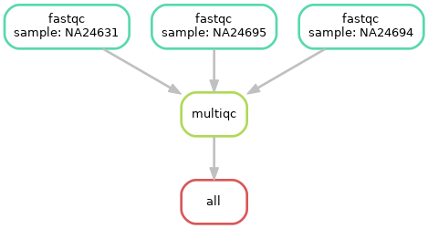

# 03 - Create a basic workflow

<p style="text-align:left;">
  <b><a class="btn" href="https://nesi.github.io/snakemake_workshop/workshop_material/02_setup.html" style="background: var(--bs-green);font-weight:bold">&laquo; 2 - Setup</a></b> 
  <span style="float:right;">
    <b><a class="btn" href="https://nesi.github.io/snakemake_workshop/workshop_material/04_leveling_up_your_workflow.html" style="background: var(--bs-green);font-weight:bold">4 - Leveling up your work &raquo;</a></b>
  </span>
</p>

* Do not remove this line (it will not be displayed)
{:toc}


## 3.01 Aim

---

*Let's create a basic workflow that will do some of the analysis steps for genetic data. We will have three samples with two files each - six files in total. These files will be processed through the below workflow, passing through three software.*

---


We have paired end sequencing data for three samples `NA24631` to process in the `./data` directory. Let's have a look:

```bash
ls -lh ./data/
```

My output:



```bash
total 13M
-rw-rw----+ 1 lkemp nesi99991 2.1M Sep 10 04:32 NA24631_1.fastq.gz
-rw-rw----+ 1 lkemp nesi99991 2.3M Sep 10 04:32 NA24631_2.fastq.gz
-rw-rw----+ 1 lkemp nesi99991 2.1M Sep 10 04:32 NA24694_1.fastq.gz
-rw-rw----+ 1 lkemp nesi99991 2.3M Sep 10 04:32 NA24694_2.fastq.gz
-rw-rw----+ 1 lkemp nesi99991 1.8M Sep 10 04:32 NA24695_1.fastq.gz
-rw-rw----+ 1 lkemp nesi99991 1.9M Sep 10 04:32 NA24695_2.fastq.gz
```




<br>

## 3.02 Snakemake workflow file structure

Workflow file structure:

```bash
demo_workflow/
      |_______results/
      |_______workflow/
                 |_______Snakefile
```

We will create and run our workflow from the `workflow` directory send all of our file outputs/results to the `results` directory

*Read up on the best practice workflow structure [here](https://snakemake.readthedocs.io/en/stable/snakefiles/deployment.html#distribution-and-reproducibility)*

Create this file structure and our main Snakefile with:

```bash
mkdir -p demo_workflow/{results,workflow}
touch demo_workflow/workflow/Snakefile
```

Now you should have the very beginnings of your Snakemake workflow in a `demo_workflow` directory. Let's have a look:

```bash
ls -lh demo_workflow/
```

My output:



```bash
total 1.0K
drwxrws---+ 2 lkemp nesi99991 4.0K Sep 13 02:57 results
drwxrws---+ 3 lkemp nesi99991 4.0K Sep 13 02:57 workflow
```




<br>

```bash
ls -lh demo_workflow/workflow/
```

My output:



```bash
total 512
-rw-rw----+ 1 lkemp nesi99991    0 Sep 13 02:57 Snakefile
```




<br>

Within the `workflow` directory (where we will create and run our workflow), we have a `Snakefile` file that will be the backbone of our workflow.

## 3.03 Run the software on the command line

First lets run the first step in our workflow ([fastqc](https://www.bioinformatics.babraham.ac.uk/projects/fastqc/)) directly on the command line to get the syntax of the command right and check what outputs files we expect to get. Knowing what files the software will output is important for Snakemake since it is a lazy "pull" based system where software/rules will only run if you tell it to create the output file. We will talk more about this later!

First make sure to have [fastqc](https://www.bioinformatics.babraham.ac.uk/projects/fastqc/) available. On NeSI, load the corresponding module

```bash
module load FastQC/0.11.9
```

See what parameters are available so we know how we want to run this software before we put it in a Snakemake workflow

```bash
fastqc --help
```

Create a test directory to put the output files

```bash
mkdir fastqc_test
```

Run fastqc directly on the command line on one of the samples

```bash
fastqc ./data/NA24631_1.fastq.gz ./data/NA24631_2.fastq.gz -o ./fastqc_test -t 2
```

My output:



```bash
Started analysis of NA24631_1.fastq.gz
Approx 5% complete for NA24631_1.fastq.gz
Approx 10% complete for NA24631_1.fastq.gz
Approx 15% complete for NA24631_1.fastq.gz
Approx 20% complete for NA24631_1.fastq.gz
Approx 25% complete for NA24631_1.fastq.gz
Approx 30% complete for NA24631_1.fastq.gz
Approx 35% complete for NA24631_1.fastq.gz
Approx 40% complete for NA24631_1.fastq.gz
Approx 45% complete for NA24631_1.fastq.gz
Approx 50% complete for NA24631_1.fastq.gz
Approx 55% complete for NA24631_1.fastq.gz
Started analysis of NA24631_2.fastq.gz
Approx 60% complete for NA24631_1.fastq.gz
Approx 5% complete for NA24631_2.fastq.gz
Approx 65% complete for NA24631_1.fastq.gz
Approx 10% complete for NA24631_2.fastq.gz
Approx 70% complete for NA24631_1.fastq.gz
Approx 75% complete for NA24631_1.fastq.gz
Approx 15% complete for NA24631_2.fastq.gz
Approx 80% complete for NA24631_1.fastq.gz
Approx 20% complete for NA24631_2.fastq.gz
Approx 85% complete for NA24631_1.fastq.gz
Approx 25% complete for NA24631_2.fastq.gz
Approx 90% complete for NA24631_1.fastq.gz
Approx 30% complete for NA24631_2.fastq.gz
Approx 95% complete for NA24631_1.fastq.gz
Approx 35% complete for NA24631_2.fastq.gz
Analysis complete for NA24631_1.fastq.gz
Approx 40% complete for NA24631_2.fastq.gz
Approx 45% complete for NA24631_2.fastq.gz
Approx 50% complete for NA24631_2.fastq.gz
Approx 55% complete for NA24631_2.fastq.gz
Approx 60% complete for NA24631_2.fastq.gz
Approx 65% complete for NA24631_2.fastq.gz
Approx 70% complete for NA24631_2.fastq.gz
Approx 75% complete for NA24631_2.fastq.gz
Approx 80% complete for NA24631_2.fastq.gz
Approx 85% complete for NA24631_2.fastq.gz
Approx 90% complete for NA24631_2.fastq.gz
Approx 95% complete for NA24631_2.fastq.gz
Analysis complete for NA24631_2.fastq.gz
```




<br>

What are the output files of fastqc? Find out with:

```bash
ls -lh ./fastqc_test
```

My output:



```bash
total 2.5M
-rw-rw----+ 1 lkemp nesi99991 718K Sep 10 04:38 NA24631_1_fastqc.html
-rw-rw----+ 1 lkemp nesi99991 475K Sep 10 04:38 NA24631_1_fastqc.zip
-rw-rw----+ 1 lkemp nesi99991 726K Sep 10 04:38 NA24631_2_fastqc.html
-rw-rw----+ 1 lkemp nesi99991 479K Sep 10 04:38 NA24631_2_fastqc.zip
```




<br>

## 3.04 Create the first rule in your workflow

Let's wrap this up in a Snakemake workflow! Start with the basic structure of a Snakefile:

```diff
# target OUTPUT files for the whole workflow
rule all:
    input:

# workflow
rule my_rule:
    input:
        ""
    output:
        ""
    threads:
    shell:
        ""
```

Now add our fastqc rule, let's:

- Name the rule
- Fill in the the input fastq files from the `data` directory (*path relative to the Snakefile*)
- Fill in the output files (now you can see it's useful to know what files fastqc outputs!)
- Set the number of threads
- Write the fastqc shell command in the `shell:` section and pass the input/output variables to the shell command
- Set the final output files for the whole workflow in `rule all:`

---

The use of the word `input` in `rule all` can be confusing, but in this context, it is referring to the final *output* files of the whole workflow

---

```diff
# target OUTPUT files for the whole workflow
rule all:
    input:
+         "../results/fastqc/NA24631_1_fastqc.html",
+         "../results/fastqc/NA24631_2_fastqc.html",
+         "../results/fastqc/NA24631_1_fastqc.zip",
+         "../results/fastqc/NA24631_2_fastqc.zip"

# workflow
+ rule fastqc:
      input:
+         R1 = "../../data/NA24631_1.fastq.gz",
+         R2 = "../../data/NA24631_2.fastq.gz"
      output:
+         html = ["../results/fastqc/NA24631_1_fastqc.html", "../results/fastqc/NA24631_2_fastqc.html"],
+         zip = ["../results/fastqc/NA24631_1_fastqc.zip", "../results/fastqc/NA24631_2_fastqc.zip"]
+     threads: 2
      shell:
+         "fastqc {input.R1} {input.R2} -o ../results/fastqc/ -t {threads}"
```

When you have multiple input and output files:

- You can "name" you inputs/outputs, they can be called separately in the shell command
- Remember to use commas between multiple inputs/outputs, it's a common source of error!

Let's test the workflow! First we need to be in the `workflow` directory, where the Snakefile is

```bash
cd demo_workflow/workflow/
```

## 3.05 Dryrun

Then let's carry out a dryrun of the workflow, where no actual analysis is undertaken (fastqc is *not* run) but the overall Snakemake structure is run/validated. This is a good way to check for errors in your Snakemake workflow before actually running your workflow.

```bash
snakemake --dryrun
```

My output:



```bash
Building DAG of jobs...
Job stats:
job       count    min threads    max threads
------  -------  -------------  -------------
all           1              1              1
fastqc        1              1              1
total         2              1              1


[Mon Sep 13 03:03:00 2021]
rule fastqc:
    input: ../../data/NA24631_1.fastq.gz, ../../data/NA24631_2.fastq.gz
    output: ../results/fastqc/NA24631_1_fastqc.html, ../results/fastqc/NA24631_2_fastqc.html, ../results/fastqc/NA24631_1_fastqc.zip, ../results/fastqc/NA24631_2_fastqc.zip
    jobid: 1
    resources: tmpdir=/dev/shm/jobs/22281190


[Mon Sep 13 03:03:00 2021]
localrule all:
    input: ../results/fastqc/NA24631_1_fastqc.html, ../results/fastqc/NA24631_2_fastqc.html, ../results/fastqc/NA24631_1_fastqc.zip, ../results/fastqc/NA24631_2_fastqc.zip
    jobid: 0
    resources: tmpdir=/dev/shm/jobs/22281190

Job stats:
job       count    min threads    max threads
------  -------  -------------  -------------
all           1              1              1
fastqc        1              1              1
total         2              1              1

This was a dry-run (flag -n). The order of jobs does not reflect the order of execution.
```




<br>

The last table in the output confirms that the workflow will run one sample (`count 1`) through fastqc (`job fastqc`), with a minimum of 2 threads (min threads 2) and a maximum of 2 threads (`max threads 2`)

## 3.06 Create a DAG

We can also visualise our workflow by creating a [directed acyclic graph](https://en.wikipedia.org/wiki/Directed_acyclic_graph) (DAG). We can tell snakemake to create a DAG with the `--dag` flag, then pipe this output to the [dot software](https://graphviz.org/) and write the output to the file, `dag_1.png`

```bash
snakemake --dag | dot -Tpng > dag_1.png
```

My DAG:







<br>

Our diagram has a node for each job which are connected by edges representing dependencies

*Note. this diagram can be output to several other image formats such as svg or pdf*

## 3.07 Fullrun

Let's do a full run of our workflow (by removing the `--dryrun` flag). We will also now need to specify the maximum number of cores to use at one time with the `--cores` flag before snakemake will run

```bash
snakemake --cores 2
```

My output:



```bash
Building DAG of jobs...
Using shell: /usr/bin/bash
Provided cores: 2
Rules claiming more threads will be scaled down.
Job stats:
job       count    min threads    max threads
------  -------  -------------  -------------
all           1              1              1
fastqc        1              2              2
total         2              1              2

Select jobs to execute...

[Mon Sep 13 03:03:42 2021]
rule fastqc:
    input: ../../data/NA24631_1.fastq.gz, ../../data/NA24631_2.fastq.gz
    output: ../results/fastqc/NA24631_1_fastqc.html, ../results/fastqc/NA24631_2_fastqc.html, ../results/fastqc/NA24631_1_fastqc.zip, ../results/fastqc/NA24631_2_fastqc.zip
    jobid: 1
    threads: 2
    resources: tmpdir=/dev/shm/jobs/22281190

Started analysis of NA24631_1.fastq.gz
Approx 5% complete for NA24631_1.fastq.gz
Approx 10% complete for NA24631_1.fastq.gz
Approx 15% complete for NA24631_1.fastq.gz
Approx 20% complete for NA24631_1.fastq.gz
Approx 25% complete for NA24631_1.fastq.gz
Approx 30% complete for NA24631_1.fastq.gz
Approx 35% complete for NA24631_1.fastq.gz
Approx 40% complete for NA24631_1.fastq.gz
Approx 45% complete for NA24631_1.fastq.gz
Approx 50% complete for NA24631_1.fastq.gz
Started analysis of NA24631_2.fastq.gz
Approx 55% complete for NA24631_1.fastq.gz
Approx 5% complete for NA24631_2.fastq.gz
Approx 60% complete for NA24631_1.fastq.gz
Approx 10% complete for NA24631_2.fastq.gz
Approx 65% complete for NA24631_1.fastq.gz
Approx 15% complete for NA24631_2.fastq.gz
Approx 70% complete for NA24631_1.fastq.gz
Approx 20% complete for NA24631_2.fastq.gz
Approx 75% complete for NA24631_1.fastq.gz
Approx 25% complete for NA24631_2.fastq.gz
Approx 80% complete for NA24631_1.fastq.gz
Approx 30% complete for NA24631_2.fastq.gz
Approx 85% complete for NA24631_1.fastq.gz
Approx 35% complete for NA24631_2.fastq.gz
Approx 90% complete for NA24631_1.fastq.gz
Approx 40% complete for NA24631_2.fastq.gz
Approx 95% complete for NA24631_1.fastq.gz
Approx 45% complete for NA24631_2.fastq.gz
Analysis complete for NA24631_1.fastq.gz
Approx 50% complete for NA24631_2.fastq.gz
Approx 55% complete for NA24631_2.fastq.gz
Approx 60% complete for NA24631_2.fastq.gz
Approx 65% complete for NA24631_2.fastq.gz
Approx 70% complete for NA24631_2.fastq.gz
Approx 75% complete for NA24631_2.fastq.gz
Approx 80% complete for NA24631_2.fastq.gz
Approx 85% complete for NA24631_2.fastq.gz
Approx 90% complete for NA24631_2.fastq.gz
Approx 95% complete for NA24631_2.fastq.gz
Analysis complete for NA24631_2.fastq.gz
[Mon Sep 13 03:03:46 2021]
Finished job 1.
1 of 2 steps (50%) done
Select jobs to execute...

[Mon Sep 13 03:03:46 2021]
localrule all:
    input: ../results/fastqc/NA24631_1_fastqc.html, ../results/fastqc/NA24631_2_fastqc.html, ../results/fastqc/NA24631_1_fastqc.zip, ../results/fastqc/NA24631_2_fastqc.zip
    jobid: 0
    resources: tmpdir=/dev/shm/jobs/22281190

[Mon Sep 13 03:03:46 2021]
Finished job 0.
2 of 2 steps (100%) done
Complete log: /scale_wlg_persistent/filesets/project/nesi99991/snakemake20210914/lkemp/snakemake_workshop/demo_workflow/workflow/.snakemake/log/2021-09-13T030341.513736.snakemake.log
```




<br>

It worked! Now in our results directory we have our output files from fastqc. Let's have a look:

```bash
ls -lh ../results/fastqc/
```

My output:



```bash
total 3.5M
-rw-rw-r-- 1 lkemp lkemp 718K Sep  1 16:39 NA24631_1_fastqc.html
-rw-rw-r-- 1 lkemp lkemp 475K Sep  1 16:39 NA24631_1_fastqc.zip
-rw-rw-r-- 1 lkemp lkemp 726K Sep  1 16:39 NA24631_2_fastqc.html
-rw-rw-r-- 1 lkemp lkemp 479K Sep  1 16:39 NA24631_2_fastqc.zip
```




<br>

## 3.08 Lazy evaluation

What happens if we try a dryrun or full run now?

```bash
snakemake --dryrun --cores 2
```

My output:



```bash
Building DAG of jobs...
Nothing to be done.
```




<br>

```bash
snakemake --cores 2
```

My output:



```bash
Building DAG of jobs...
Nothing to be done.
Complete log: /scale_wlg_persistent/filesets/project/nesi99991/snakemake20210914/lkemp/snakemake_workshop/demo_workflow/workflow/.snakemake/log/2021-09-13T030445.098954.snakemake.log
```




<br>

Nothing happens, all the target files in `rule all` have already been created so Snakemake does nothing

Also, what happens if we create another directed acyclic graph (DAG) after the workflow has been run?

```bash
snakemake --dag | dot -Tpng > dag.png
```

My DAG:







<br>

Notice our workflow 'job nodes' are now dashed lines, this indicates that their output is up to date and therefore the rule doesn't need to be run. We already have our target files!

This can be quite informative if your workflow errors out at a rule. You can visually check which rules successfully ran and which didn't.

## 3.09 Run using environment modules

fastqc worked because we loaded it in our current shell session. Let's specify the environment module for fastqc so the user of the workflow doesn't need to load it manually.

Update our rule to use it using the `envmodules:` directive

```diff
# target OUTPUT files for the whole workflow
rule all:
    input:
        "../results/fastqc/NA24631_1_fastqc.html",
        "../results/fastqc/NA24631_2_fastqc.html",
        "../results/fastqc/NA24631_1_fastqc.zip",
        "../results/fastqc/NA24631_2_fastqc.zip"

# workflow
rule fastqc:
    input:
        R1 = "../../data/NA24631_1.fastq.gz",
        R2 = "../../data/NA24631_2.fastq.gz"
    output:
        html = ["../results/fastqc/NA24631_1_fastqc.html", "../results/fastqc/NA24631_2_fastqc.html"],
        zip = ["../results/fastqc/NA24631_1_fastqc.zip", "../results/fastqc/NA24631_2_fastqc.zip"]
    threads: 2
+   envmodules:
+       "FastQC/0.11.9"
    shell:
        "fastqc {input.R1} {input.R2} -o ../results/fastqc/ -t {threads}"
```

Run again, now telling Snakemake to use [environment modules](https://nesi.github.io/hpc-intro/14-modules/index.html) to automatically load our software by using the `--use-envmodules` flag

```diff
# first remove output of last run
rm -r ../results/*

# Run dryrun again
- snakemake --dryrun --cores 2
+ snakemake --dryrun --cores 2 --use-envmodules
```

My output:



```bash
Building DAG of jobs...
Conda environment envs/fastqc.yaml will be created.
Job stats:
job       count    min threads    max threads
------  -------  -------------  -------------
all           1              1              1
fastqc        1              2              2
total         2              1              2


[Mon Sep 13 03:06:45 2021]
rule fastqc:
    input: ../../data/NA24631_1.fastq.gz, ../../data/NA24631_2.fastq.gz
    output: ../results/fastqc/NA24631_1_fastqc.html, ../results/fastqc/NA24631_2_fastqc.html, ../results/fastqc/NA24631_1_fastqc.zip, ../results/fastqc/NA24631_2_fastqc.zip
    jobid: 1
    threads: 2
    resources: tmpdir=/dev/shm/jobs/22281190


[Mon Sep 13 03:06:45 2021]
localrule all:
    input: ../results/fastqc/NA24631_1_fastqc.html, ../results/fastqc/NA24631_2_fastqc.html, ../results/fastqc/NA24631_1_fastqc.zip, ../results/fastqc/NA24631_2_fastqc.zip
    jobid: 0
    resources: tmpdir=/dev/shm/jobs/22281190

Job stats:
job       count    min threads    max threads
------  -------  -------------  -------------
all           1              1              1
fastqc        1              2              2
total         2              1              2

This was a dry-run (flag -n). The order of jobs does not reflect the order of execution.
```




<br>

Let's do a full run

```diff
- snakemake --cores 2
+ snakemake --cores 2 --use-envmodules
```

My output:



```bash
Building DAG of jobs...
Creating conda environment envs/fastqc.yaml...
Downloading and installing remote packages.
Environment for envs/fastqc.yaml created (location: .snakemake/conda/67c1376bae89b8de73037e703ea4b6f5)
Using shell: /usr/bin/bash
Provided cores: 2
Rules claiming more threads will be scaled down.
Job stats:
job       count    min threads    max threads
------  -------  -------------  -------------
all           1              1              1
fastqc        1              2              2
total         2              1              2

Select jobs to execute...

[Mon Sep 13 03:10:27 2021]
rule fastqc:
    input: ../../data/NA24631_1.fastq.gz, ../../data/NA24631_2.fastq.gz
    output: ../results/fastqc/NA24631_1_fastqc.html, ../results/fastqc/NA24631_2_fastqc.html, ../results/fastqc/NA24631_1_fastqc.zip, ../results/fastqc/NA24631_2_fastqc.zip
    jobid: 1
    threads: 2
    resources: tmpdir=/dev/shm/jobs/22281190

Activating conda environment: /scale_wlg_persistent/filesets/project/nesi99991/snakemake20210914/lkemp/snakemake_workshop/demo_workflow/workflow/.snakemake/conda/67c1376bae89b8de73037e703ea4b6f5
Started analysis of NA24631_1.fastq.gz
Approx 5% complete for NA24631_1.fastq.gz
Approx 10% complete for NA24631_1.fastq.gz
Approx 15% complete for NA24631_1.fastq.gz
Approx 20% complete for NA24631_1.fastq.gz
Approx 25% complete for NA24631_1.fastq.gz
Approx 30% complete for NA24631_1.fastq.gz
Approx 35% complete for NA24631_1.fastq.gz
Approx 40% complete for NA24631_1.fastq.gz
Approx 45% complete for NA24631_1.fastq.gz
Approx 50% complete for NA24631_1.fastq.gz
Approx 55% complete for NA24631_1.fastq.gz
Approx 60% complete for NA24631_1.fastq.gz
Started analysis of NA24631_2.fastq.gz
Approx 65% complete for NA24631_1.fastq.gz
Approx 5% complete for NA24631_2.fastq.gz
Approx 70% complete for NA24631_1.fastq.gz
Approx 10% complete for NA24631_2.fastq.gz
Approx 75% complete for NA24631_1.fastq.gz
Approx 15% complete for NA24631_2.fastq.gz
Approx 80% complete for NA24631_1.fastq.gz
Approx 20% complete for NA24631_2.fastq.gz
Approx 85% complete for NA24631_1.fastq.gz
Approx 25% complete for NA24631_2.fastq.gz
Approx 90% complete for NA24631_1.fastq.gz
Approx 30% complete for NA24631_2.fastq.gz
Approx 95% complete for NA24631_1.fastq.gz
Approx 35% complete for NA24631_2.fastq.gz
Analysis complete for NA24631_1.fastq.gz
Approx 40% complete for NA24631_2.fastq.gz
Approx 45% complete for NA24631_2.fastq.gz
Approx 50% complete for NA24631_2.fastq.gz
Approx 55% complete for NA24631_2.fastq.gz
Approx 60% complete for NA24631_2.fastq.gz
Approx 65% complete for NA24631_2.fastq.gz
Approx 70% complete for NA24631_2.fastq.gz
Approx 75% complete for NA24631_2.fastq.gz
Approx 80% complete for NA24631_2.fastq.gz
Approx 85% complete for NA24631_2.fastq.gz
Approx 90% complete for NA24631_2.fastq.gz
Approx 95% complete for NA24631_2.fastq.gz
Analysis complete for NA24631_2.fastq.gz
[Mon Sep 13 03:10:33 2021]
Finished job 1.
1 of 2 steps (50%) done
Select jobs to execute...

[Mon Sep 13 03:10:33 2021]
localrule all:
    input: ../results/fastqc/NA24631_1_fastqc.html, ../results/fastqc/NA24631_2_fastqc.html, ../results/fastqc/NA24631_1_fastqc.zip, ../results/fastqc/NA24631_2_fastqc.zip
    jobid: 0
    resources: tmpdir=/dev/shm/jobs/22281190

[Mon Sep 13 03:10:33 2021]
Finished job 0.
2 of 2 steps (100%) done
Complete log: /scale_wlg_persistent/filesets/project/nesi99991/snakemake20210914/lkemp/snakemake_workshop/demo_workflow/workflow/.snakemake/log/2021-09-13T030734.543325.snakemake.log
```




<br>

Notice it now says that "Activating environment modules: FastQC/0.11.9". Now the software our workflow uses will be automatically loaded!

## 3.10 Capture our logs

So far our logs (for fastqc) have been simply printed to our screen. As you can imagine, if you had a large automated workflow (that you might not be sitting at the computer watching run) you'll want to capture all that information. Therefore, any information the software spits out (including error messages!) will be kept and can be looked at once you return to your machine from your coffee break.

We can get the logs for each rule to be written to a log file via the `log:` directive:

- It's a good idea to organise the logs by:
  - Putting the logs in a directory labelled after the rule/software that was run
  - Labelling the log files with the sample name the software was run on

- Also make sure you tell the software (fastqc) to write the standard output and standard error to this log file we defined in the `log:` directive in the shell script (eg. `&> {log}`)

```diff
# target OUTPUT files for the whole workflow
rule all:
    input:
        "../results/fastqc/NA24631_1_fastqc.html",
        "../results/fastqc/NA24631_2_fastqc.html",
        "../results/fastqc/NA24631_1_fastqc.zip",
        "../results/fastqc/NA24631_2_fastqc.zip"

# workflow
rule fastqc:
    input:
        R1 = "../../data/NA24631_1.fastq.gz",
        R2 = "../../data/NA24631_2.fastq.gz"
    output:
        html = ["../results/fastqc/NA24631_1_fastqc.html", "../results/fastqc/NA24631_2_fastqc.html"],
        zip = ["../results/fastqc/NA24631_1_fastqc.zip", "../results/fastqc/NA24631_2_fastqc.zip"]
+   log:
+       "logs/fastqc/NA24631.log"
    threads: 2
    envmodules:
        "FastQC/0.11.9"
    shell:
-       "fastqc {input.R1} {input.R2} -o ../results/fastqc/ -t {threads}"
+       "fastqc {input.R1} {input.R2} -o ../results/fastqc/ -t {threads} &> {log}"
```

---

A tangent about [standard streams](https://en.wikipedia.org/wiki/Standard_streams)

- These are standard streams in which information is returned by a computer process - in our case the logs that we see returned to us on our screen when we run fastqc
- There are two main streams:
  - standard output (the log messages)
  - standard error (the error messages)

Different ways to write log files:

|  Syntax  | standard output in terminal | standard error in terminal | standard output in file | standard error in file |
|----------|-----------------------------|----------------------------|-------------------------|------------------------|
|   `>`    |  NO                         | YES                        | YES                     | NO                     |
|   `2>`   |  YES                        | NO                         | NO                      | YES                    |
|   `&>`   |  NO                         | NO                         | YES                     | YES                    |

(Table adapted from [here](https://askubuntu.com/questions/420981/how-do-i-save-terminal-output-to-a-file))

---

Run again

```bash
# remove output of last run
rm -r ../results/*

# run dryrun/run again
snakemake --dryrun --cores 2 --use-envmodules
snakemake --cores 2 --use-envmodules
```

My output:



```bash
Building DAG of jobs...
Using shell: /usr/bin/bash
Provided cores: 2
Rules claiming more threads will be scaled down.
Job stats:
job       count    min threads    max threads
------  -------  -------------  -------------
all           1              1              1
fastqc        1              2              2
total         2              1              2

Select jobs to execute...

[Mon Sep 13 03:14:19 2021]
rule fastqc:
    input: ../../data/NA24631_1.fastq.gz, ../../data/NA24631_2.fastq.gz
    output: ../results/fastqc/NA24631_1_fastqc.html, ../results/fastqc/NA24631_2_fastqc.html, ../results/fastqc/NA24631_1_fastqc.zip, ../results/fastqc/NA24631_2_fastqc.zip
    log: logs/fastqc/NA24631.log
    jobid: 1
    threads: 2
    resources: tmpdir=/dev/shm/jobs/22281190

Activating conda environment: /scale_wlg_persistent/filesets/project/nesi99991/snakemake20210914/lkemp/snakemake_workshop/demo_workflow/workflow/.snakemake/conda/67c1376bae89b8de73037e703ea4b6f5
[Mon Sep 13 03:14:24 2021]
Finished job 1.
1 of 2 steps (50%) done
Select jobs to execute...

[Mon Sep 13 03:14:24 2021]
localrule all:
    input: ../results/fastqc/NA24631_1_fastqc.html, ../results/fastqc/NA24631_2_fastqc.html, ../results/fastqc/NA24631_1_fastqc.zip, ../results/fastqc/NA24631_2_fastqc.zip
    jobid: 0
    resources: tmpdir=/dev/shm/jobs/22281190

[Mon Sep 13 03:14:24 2021]
Finished job 0.
2 of 2 steps (100%) done
Complete log: /scale_wlg_persistent/filesets/project/nesi99991/snakemake20210914/lkemp/snakemake_workshop/demo_workflow/workflow/.snakemake/log/2021-09-13T031415.725355.snakemake.log
```




<br>

We now have a log file, lets have a look at the first 10 lines of our log with:

```bash
head ./logs/fastqc/NA24631.log
```

My output:



```bash
Started analysis of NA24631_1.fastq.gz
Approx 5% complete for NA24631_1.fastq.gz
Approx 10% complete for NA24631_1.fastq.gz
Approx 15% complete for NA24631_1.fastq.gz
Approx 20% complete for NA24631_1.fastq.gz
Approx 25% complete for NA24631_1.fastq.gz
Approx 30% complete for NA24631_1.fastq.gz
Approx 35% complete for NA24631_1.fastq.gz
Approx 40% complete for NA24631_1.fastq.gz
Approx 45% complete for NA24631_1.fastq.gz
```




<br>

<p align="center"><b>We have logs. Tidy logs.</b><br></p>


> **Exercise:**
>
> Try creating an error in the shell command (for example remove the `-o` flag) and use the three different syntaxes for writing to your log file. What is and isn't printed to your screen and to your log file?

## 3.11 Scale up to analyse all of our samples

We are currently only analysing one of our three samples

Let's scale up to run all of our samples by using [wildcards](https://snakemake.readthedocs.io/en/stable/snakefiles/rules.html#wildcards), this way we can grab all the samples/files in the `data` directory and analyse them

- Set a global wildcard that defines the samples to be analysed
- Generalise where this rule uses an individual sample (`NA24631`) to use this wildcard `{sample}`
- Use the [expand function](https://snakemake.readthedocs.io/en/stable/snakefiles/rules.html#the-expand-function) (`expand()`) function to tell snakemake that `{sample}` is what we defined in our global wildcard `SAMPLES,`
- Snakemake can figure out what `{sample}` is in our rule since it's defined in the targets in `rule all:`

```diff
# define samples from data directory using wildcards
+ SAMPLES, = glob_wildcards("../../data/{sample}_1.fastq.gz")

# target OUTPUT files for the whole workflow
rule all:
    input:
-       "../results/fastqc/NA24631_1_fastqc.html",
-       "../results/fastqc/NA24631_2_fastqc.html",
-       "../results/fastqc/NA24631_1_fastqc.zip",
-       "../results/fastqc/NA24631_2_fastqc.zip"
+       expand("../results/fastqc/{sample}_1_fastqc.html", sample = SAMPLES),
+       expand("../results/fastqc/{sample}_2_fastqc.html", sample = SAMPLES),
+       expand("../results/fastqc/{sample}_1_fastqc.zip", sample = SAMPLES),
+       expand("../results/fastqc/{sample}_2_fastqc.zip", sample = SAMPLES)

# workflow
rule fastqc:
    input:
-       R1 = "../../data/NA24631_1.fastq.gz",
-       R2 = "../../data/NA24631_2.fastq.gz"
+       R1 = "../../data/{sample}_1.fastq.gz",
+       R2 = "../../data/{sample}_2.fastq.gz"
    output:
-       html = ["../results/fastqc/NA24631_1_fastqc.html", "../results/fastqc/NA24631_2_fastqc.html"],
-       zip = ["../results/fastqc/NA24631_1_fastqc.zip", "../results/fastqc/NA24631_2_fastqc.zip"]
+       html = ["../results/fastqc/{sample}_1_fastqc.html", "../results/fastqc/{sample}_2_fastqc.html"],
+       zip = ["../results/fastqc/{sample}_1_fastqc.zip", "../results/fastqc/{sample}_2_fastqc.zip"]
    log:
-       "logs/fastqc/NA24631.log"
+       "logs/fastqc/{sample}.log"
    threads: 2
    envmodules:
        "FastQC/0.11.9"
    shell:
        "fastqc {input.R1} {input.R2} -o ../results/fastqc/ -t {threads} &> {log}"
```

Visualise workflow

```bash
snakemake --dag | dot -Tpng > dag_2.png
```

Now we have three samples running though our workflow, one of which has already been run in our last run (NA24631) indicated by the dashed lines

My DAG:







<br>

Run workflow again

```bash
# remove output of last run
rm -r ../results/*

# run dryrun again
snakemake --dryrun --cores 2 --use-envmodules
```

See how it now runs over all three of our samples in the output of the dryrun

My output:



```bash
Building DAG of jobs...
Job stats:
job       count    min threads    max threads
------  -------  -------------  -------------
all           1              1              1
fastqc        3              2              2
total         4              1              2


[Mon Sep 13 03:23:58 2021]
rule fastqc:
    input: ../../data/NA24694_1.fastq.gz, ../../data/NA24694_2.fastq.gz
    output: ../results/fastqc/NA24694_1_fastqc.html, ../results/fastqc/NA24694_2_fastqc.html, ../results/fastqc/NA24694_1_fastqc.zip, ../results/fastqc/NA24694_2_fastqc.zip
    log: logs/fastqc/NA24694.log
    jobid: 3
    wildcards: sample=NA24694
    threads: 2
    resources: tmpdir=/dev/shm/jobs/22281190


[Mon Sep 13 03:23:58 2021]
rule fastqc:
    input: ../../data/NA24695_1.fastq.gz, ../../data/NA24695_2.fastq.gz
    output: ../results/fastqc/NA24695_1_fastqc.html, ../results/fastqc/NA24695_2_fastqc.html, ../results/fastqc/NA24695_1_fastqc.zip, ../results/fastqc/NA24695_2_fastqc.zip
    log: logs/fastqc/NA24695.log
    jobid: 2
    wildcards: sample=NA24695
    threads: 2
    resources: tmpdir=/dev/shm/jobs/22281190


[Mon Sep 13 03:23:58 2021]
rule fastqc:
    input: ../../data/NA24631_1.fastq.gz, ../../data/NA24631_2.fastq.gz
    output: ../results/fastqc/NA24631_1_fastqc.html, ../results/fastqc/NA24631_2_fastqc.html, ../results/fastqc/NA24631_1_fastqc.zip, ../results/fastqc/NA24631_2_fastqc.zip
    log: logs/fastqc/NA24631.log
    jobid: 1
    wildcards: sample=NA24631
    threads: 2
    resources: tmpdir=/dev/shm/jobs/22281190


[Mon Sep 13 03:23:58 2021]
localrule all:
    input: ../results/fastqc/NA24631_1_fastqc.html, ../results/fastqc/NA24695_1_fastqc.html, ../results/fastqc/NA24694_1_fastqc.html, ../results/fastqc/NA24631_2_fastqc.html, ../results/fastqc/NA24695_2_fastqc.html, ../results/fastqc/NA24694_2_fastqc.html, ../results/fastqc/NA24631_1_fastqc.zip, ../results/fastqc/NA24695_1_fastqc.zip, ../results/fastqc/NA24694_1_fastqc.zip, ../results/fastqc/NA24631_2_fastqc.zip, ../results/fastqc/NA24695_2_fastqc.zip, ../results/fastqc/NA24694_2_fastqc.zip
    jobid: 0
    resources: tmpdir=/dev/shm/jobs/22281190

Job stats:
job       count    min threads    max threads
------  -------  -------------  -------------
all           1              1              1
fastqc        3              2              2
total         4              1              2

This was a dry-run (flag -n). The order of jobs does not reflect the order of execution.
```




<br>

```bash
# full run again
snakemake --cores 2 --use-envmodules
```

All three samples were run through our workflow! And we have a log file for each sample for the fastqc rule

```bash
ls -lh ./logs/fastqc
```

My output:



```bash
total 1.5K
-rw-rw----+ 1 lkemp nesi99991 1.8K Sep 13 03:24 NA24631.log
-rw-rw----+ 1 lkemp nesi99991 1.8K Sep 13 03:24 NA24694.log
-rw-rw----+ 1 lkemp nesi99991 1.8K Sep 13 03:24 NA24695.log
```




<br>

## 3.12 Add more rules

- Connect the outputs of fastqc to the inputs of multiqc
- Add a new final target for `rule all:`

```diff
# define samples from data directory using wildcards
SAMPLES, = glob_wildcards("../../data/{sample}_1.fastq.gz")

# target OUTPUT files for the whole workflow
rule all:
    input:
        expand("../results/fastqc/{sample}_1_fastqc.html", sample = SAMPLES),
        expand("../results/fastqc/{sample}_2_fastqc.html", sample = SAMPLES),
        expand("../results/fastqc/{sample}_1_fastqc.zip", sample = SAMPLES),
-       expand("../results/fastqc/{sample}_2_fastqc.zip", sample = SAMPLES)
+       expand("../results/fastqc/{sample}_2_fastqc.zip", sample = SAMPLES),
+       "../results/multiqc_report.html"

# workflow
rule fastqc:
    input:
        R1 = "../../data/{sample}_1.fastq.gz",
        R2 = "../../data/{sample}_2.fastq.gz"
    output:
        html = ["../results/fastqc/{sample}_1_fastqc.html", "../results/fastqc/{sample}_2_fastqc.html"],
        zip = ["../results/fastqc/{sample}_1_fastqc.zip", "../results/fastqc/{sample}_2_fastqc.zip"]
    log:
        "logs/fastqc/{sample}.log"
    threads: 2
    envmodules:
        "FastQC/0.11.9"
    shell:
        "fastqc {input.R1} {input.R2} -o ../results/fastqc/ -t {threads} &> {log}"
  
+ rule multiqc:
+     input:
+         ["../results/fastqc/{sample}_1_fastqc.zip", "../results/fastqc/{sample}_2_fastqc.zip"]
+     output:
+         "../results/multiqc_report.html"
+     log:
+         "logs/multiqc/multiqc.log"
+     envmodules:
+         "MultiQC/1.9-gimkl-2020a-Python-3.8.2"
+     shell:
+         "multiqc {input} -o ../results/ &> {log}"
```

Run workflow again

```bash
# remove output of last run
rm -r ../results/*

# run dryrun/run again
snakemake --dryrun --cores 2 --use-envmodules
snakemake --cores 2 --use-envmodules
```

Didn't work?

My error:



```bash
Building DAG of jobs...
WildcardError in line 29 of /scale_wlg_persistent/filesets/project/nesi99991/snakemake20210914/lkemp/snakemake_workshop/demo_workflow/workflow/Snakefile:
Wildcards in input files cannot be determined from output files:
'sample'
```




<br>

Since we haven't defined `{sample}` in `rule all:` for multiqc, we need to define it somewhere! Let do so in the multiqc rule

```diff
# define samples from data directory using wildcards
SAMPLES, = glob_wildcards("../../data/{sample}_1.fastq.gz")

# target OUTPUT files for the whole workflow
rule all:
    input:
        expand("../results/fastqc/{sample}_1_fastqc.html", sample = SAMPLES),
        expand("../results/fastqc/{sample}_2_fastqc.html", sample = SAMPLES),
        expand("../results/fastqc/{sample}_1_fastqc.zip", sample = SAMPLES),
        expand("../results/fastqc/{sample}_2_fastqc.zip", sample = SAMPLES),
        "../results/multiqc_report.html"

# workflow
rule fastqc:
    input:
        R1 = "../../data/{sample}_1.fastq.gz",
        R2 = "../../data/{sample}_2.fastq.gz"
    output:
        html = ["../results/fastqc/{sample}_1_fastqc.html", "../results/fastqc/{sample}_2_fastqc.html"],
        zip = ["../results/fastqc/{sample}_1_fastqc.zip", "../results/fastqc/{sample}_2_fastqc.zip"]
    log:
        "logs/fastqc/{sample}.log"
    threads: 2
    envmodules:
        "FastQC/0.11.9"
    shell:
        "fastqc {input.R1} {input.R2} -o ../results/fastqc/ -t {threads} &> {log}"
  
rule multiqc:
    input:
-       ["../results/fastqc/{sample}_1_fastqc.zip", "../results/fastqc/{sample}_2_fastqc.zip"]
+       expand(["../results/fastqc/{sample}_1_fastqc.zip", "../results/fastqc/{sample}_2_fastqc.zip"], sample = SAMPLES)
    output:
        "../results/multiqc_report.html"
    log:
        "logs/multiqc/multiqc.log"
    envmodules:
        "MultiQC/1.9-gimkl-2020a-Python-3.8.2"
    shell:
        "multiqc {input} -o ../results/ &> {log}"
```

Visualise workflow

```bash
snakemake --dag | dot -Tpng > dag_3.png
```

Now we have two rules in our workflow (fastqc and multiqc), we can also see that multiqc isn't run for each sample (since it merges the output of fastqc for all samples)

My DAG:







<br>

Run again

```bash
# remove output of last run
rm -r ../results/*

# run dryrun/run again
snakemake --dryrun --cores 2 --use-envmodules
snakemake --cores 2 --use-envmodules
```

## 3.13 More about Snakemake's lazy behaviour

What happens if we only have the final target file (`../results/multiqc_report.html`) in `rule all:`

```diff
# define samples from data directory using wildcards
SAMPLES, = glob_wildcards("../../data/{sample}_1.fastq.gz")

# target OUTPUT files for the whole workflow
rule all:
    input:
-       expand("../results/fastqc/{sample}_1_fastqc.html", sample = SAMPLES),
-       expand("../results/fastqc/{sample}_2_fastqc.html", sample = SAMPLES),
-       expand("../results/fastqc/{sample}_1_fastqc.zip", sample = SAMPLES),
-       expand("../results/fastqc/{sample}_2_fastqc.zip", sample = SAMPLES),
        "../results/multiqc_report.html"

# workflow
rule fastqc:
    input:
        R1 = "../../data/{sample}_1.fastq.gz",
        R2 = "../../data/{sample}_2.fastq.gz"
    output:
        html = ["../results/fastqc/{sample}_1_fastqc.html", "../results/fastqc/{sample}_2_fastqc.html"],
        zip = ["../results/fastqc/{sample}_1_fastqc.zip", "../results/fastqc/{sample}_2_fastqc.zip"]
    log:
        "logs/fastqc/{sample}.log"
    threads: 2
    envmodules:
        "FastQC/0.11.9"
    shell:
        "fastqc {input.R1} {input.R2} -o ../results/fastqc/ -t {threads} &> {log}"
  
rule multiqc:
    input:
        expand(["../results/fastqc/{sample}_1_fastqc.zip", "../results/fastqc/{sample}_2_fastqc.zip"], sample = SAMPLES)
    output:
        "../results/multiqc_report.html"
    log:
        "logs/multiqc/multiqc.log"
    envmodules:
        "MultiQC/1.9-gimkl-2020a-Python-3.8.2"
    shell:
        "multiqc {input} -o ../results/ &> {log}"
```

Run workflow again

```bash
# remove output of last run
rm -r ../results/*

# run dryrun again
snakemake --dryrun --cores 2 --use-envmodules
```

It still works because it is the last file in the workflow sequence, Snakemake will do all the steps necessary to get to this target file (therefore it runs both fastqc and multiqc)

Visualise workflow

```bash
snakemake --dag | dot -Tpng > dag_4.png
```

Although the workflow ran the same, the DAG actually changed slightly, now there is only one file target and only the output of multiqc goes to `rule all`

My DAG:







<br>

<p align="center"><b>Beware: Snakemake will also NOT run rules that it doesn't need to run in order to get the target files defined in rule: all</b><br></p>

For example if only our fastqc outputs are defined as the target in `rule: all`

```diff
# define samples from data directory using wildcards
SAMPLES, = glob_wildcards("../../data/{sample}_1.fastq.gz")

# target OUTPUT files for the whole workflow
rule all:
    input:
+       expand("../results/fastqc/{sample}_1_fastqc.html", sample = SAMPLES),
+       expand("../results/fastqc/{sample}_2_fastqc.html", sample = SAMPLES),
+       expand("../results/fastqc/{sample}_1_fastqc.zip", sample = SAMPLES),
+       expand("../results/fastqc/{sample}_2_fastqc.zip", sample = SAMPLES)
-       "../results/multiqc_report.html"

# workflow
rule fastqc:
    input:
        R1 = "../../data/{sample}_1.fastq.gz",
        R2 = "../../data/{sample}_2.fastq.gz"
    output:
        html = ["../results/fastqc/{sample}_1_fastqc.html", "../results/fastqc/{sample}_2_fastqc.html"],
        zip = ["../results/fastqc/{sample}_1_fastqc.zip", "../results/fastqc/{sample}_2_fastqc.zip"]
    log:
        "logs/fastqc/{sample}.log"
    threads: 2
    envmodules:
        "FastQC/0.11.9"
    shell:
        "fastqc {input.R1} {input.R2} -o ../results/fastqc/ -t {threads} &> {log}"
  
rule multiqc:
    input:
        expand(["../results/fastqc/{sample}_1_fastqc.zip", "../results/fastqc/{sample}_2_fastqc.zip"], sample = SAMPLES)
    output:
        "../results/multiqc_report.html"
    log:
        "logs/multiqc/multiqc.log"
    envmodules:
        "MultiQC/1.9-gimkl-2020a-Python-3.8.2"
    shell:
        "multiqc {input} -o ../results/ &> {log}"
```

Run again

```bash
# run dryrun again
snakemake --dryrun --cores 2 --use-envmodules
```

My partial output:



```bash
Job stats:
job       count    min threads    max threads
------  -------  -------------  -------------
all           1              1              1
fastqc        3              2              2
total         4              1              2

This was a dry-run (flag -n). The order of jobs does not reflect the order of execution.
```




<br>

Our multiqc rule won't be run/evaluated

Visualise workflow

```bash
snakemake --dag | dot -Tpng > dag_5.png
```

Now we are back to only running fastqc in our workflow, despite having our second rule (multiqc) in our workflow

My DAG:








<br>

<p align="center"><b>Snakemake is lazy.</b><br></p>


## 3.14 Add even more rules

Let's add the rest of the rules. We want to get to:


We currently have fastqc and multiqc, so we still need to add trim_galore

```diff
# define samples from data directory using wildcards
SAMPLES, = glob_wildcards("../../data/{sample}_1.fastq.gz")

# target OUTPUT files for the whole workflow
rule all:
    input:
-       expand("../results/fastqc/{sample}_1_fastqc.html", sample = SAMPLES),
-       expand("../results/fastqc/{sample}_2_fastqc.html", sample = SAMPLES),
-       expand("../results/fastqc/{sample}_1_fastqc.zip", sample = SAMPLES),
-       expand("../results/fastqc/{sample}_2_fastqc.zip", sample = SAMPLES)
+       "../results/multiqc_report.html",
+       expand(["../results/trimmed/{sample}_1_val_1.fq.gz", "../results/trimmed/{sample}_2_val_2.fq.gz"], sample = SAMPLES)

# workflow
rule fastqc:
    input:
        R1 = "../../data/{sample}_1.fastq.gz",
        R2 = "../../data/{sample}_2.fastq.gz"
    output:
        html = ["../results/fastqc/{sample}_1_fastqc.html", "../results/fastqc/{sample}_2_fastqc.html"],
        zip = ["../results/fastqc/{sample}_1_fastqc.zip", "../results/fastqc/{sample}_2_fastqc.zip"]
    log:
        "logs/fastqc/{sample}.log"
    threads: 2
    envmodules:
        "FastQC/0.11.9"
    shell:
        "fastqc {input.R1} {input.R2} -o ../results/fastqc/ -t {threads} &> {log}"
  
rule multiqc:
    input:
        expand(["../results/fastqc/{sample}_1_fastqc.zip", "../results/fastqc/{sample}_2_fastqc.zip"], sample = SAMPLES)
    output:
        "../results/multiqc_report.html"
    log:
        "logs/multiqc/multiqc.log"
    envmodules:
        "MultiQC/1.9-gimkl-2020a-Python-3.8.2"
    shell:
        "multiqc {input} -o ../results/ &> {log}"

+ rule trim_galore:
+    input:
+        ["../../data/{sample}_1.fastq.gz", "../../data/{sample}_2.fastq.gz"]
+    output:
+        ["../results/trimmed/{sample}_1_val_1.fq.gz", "../results/trimmed/{sample}_2_val_2.fq.gz"]
+    log:
+        "logs/trim_galore/{sample}.log"
+    envmodules:
+       "TrimGalore/0.6.7-gimkl-2020a-Python-3.8.2-Perl-5.30.1"
+    threads: 2
+    shell:
+        "trim_galore {input} -o ../results/trimmed/ --paired --cores {threads} &> {log}"
```

Visualise workflow

```bash
snakemake --dag | dot -Tpng > dag_6.png
```

Fantastic, we are starting to build a workflow!

My DAG:







<br>

However, when analysing many samples, our DAG can become messy and complicated. Instead, we can create a rulegraph that will let us visualise our workflow without showing every single sample that will run through it

```bash
snakemake --rulegraph | dot -Tpng > rulegraph_1.png
```

My rulegraph:







<br>

An aside: another option that will show all your input and output files at each step:

```bash
snakemake --filegraph | dot -Tpng > filegraph.png
```

My filegraph:







<br>

Run the rest of the workflow

```bash
# run dryrun/run again
snakemake --dryrun --cores 2 --use-envmodules
snakemake --cores 2 --use-envmodules
```

Notice it will run only one rule/sample/file at a time...why is that?

## 3.15 Throw it more cores

Run again allowing Snakemake to use more cores overall `--cores 4` rather than `--cores 2`

```bash
# remove output of last run
rm -r ../results/*

# run dryrun/run again
snakemake --dryrun --cores 4 --use-envmodules
snakemake --cores 4 --use-envmodules
```

Notice the whole workflow ran much faster and several samples/files/rules were running at one time. This is because we set each rule to run with 2 threads. Initially we specified that the *maximum* number of cores to be used by the workflow was 2 with the `--cores 2` flag, meaning only one rule and sample can be run at one time. When we increased the *maximum* number of cores to be used by the workflow to 4 with `--cores 4`, up to 2 samples could be run through at one time.

## 3.16 Throw it even more cores

With a high performance cluster such as [NeSi](https://www.nesi.org.nz/), you can start to REALLY scale up, particularly when you have many samples to analyse or files to process. This is because the number of cores available in a HPC is HUGE compared to a laptop or even an high end server.

<p align="center"><b>Boom! Scalability here we come!</b><br></p>

<p align="center"></p>

To run the workflow on the cluster, we need to ensure that each step is run as a dedicated job in the queuing system of the HPC. On NeSI, the queuing system is managed by [Slurm](https://slurm.schedmd.com/documentation.html).

Use the `--cluster` option to specify the job submission command, using `sbatch` on NeSI.
This command defines resources used for each job (maximum time, memory, number of cores...).
In addition, you need to specify a maximum number of concurrent jobs using `--jobs`.

```bash
# remove output of last run
rm -r ../results/*

# run again on the cluster
snakemake --cluster "sbatch --time 00:10:00 --mem 512MB --cpus-per-task 8 --account nesi99991" --jobs 10 --use-envmodules
```

If you open another terminal on the HPC, you can use the `squeue` command to list of your jobs and their state (pending, running, etc.):

```bash
squeue -u your_nesi_login
```

where `your_nesi_login` needs to be replace with your actual NeSI login.

An additional trick is to use the `watch` command to repeatedly call any command in the terminal, giving you a lightweight monitoring tool ;-).
Here we will use it to see your jobs gets queued and executed in real time:

```bash
watch squeue -u your_nesi_login
```

You can exit the view create by `watch` by pressing CTRL+C.


# Takeaways

---

- Once familiar with environment modules, the software are very straightforward to integrate in your snakemake workflow
- Run your commands directly on the command line before wrapping it up in a Snakemake rule
- First do a dryrun to check the Snakemake structure is set up correctly
- Work iteratively (get each rule working before moving onto the next)
- File paths are relative to the Snakefile
- Run your workflow from where your Snakefile is
- Visualise your workflow by creating a DAG (directed acyclic graph), a rulegraph or filegraph
- Use environment modules to load software in your workflow - this improves reproducibility
- Snakemake is lazy...
  - It will only do something if it hasn't already done it
  - It will pick up where it left off, rather than run the whole workflow again
  - It *won't* do any steps that aren't necessary to get to the target files defined in `rule: all`
- `input:` `output:` `log:` and `threads:` directives need to be called in the `shell` directive
- Capture your log files
- Organise your log files by naming them after the rule that was run and sample that was analysed
- You don't need to specify all the target files in `rule all:`, the final file in a given chain of tasks will suffice
- We can massively speed up our analyses by running our samples in parallel

---

# Summary commands

Create a directed acyclic graph (DAG) with:

```bash
snakemake --dag | dot -Tpng > dag.png
```

Create a rulegraph with:

```bash
snakemake --rulegraph | dot -Tpng > rulegraph.png
```

Create a filegraph with:

```bash
snakemake --filegraph | dot -Tpng > filegraph.png
```

Run a dryrun of your snakemake workflow with:

```bash
snakemake --dryrun
```

Run your snakemake workflow with:

```bash
snakemake --cores 2
```

Run a dryrun of your snakemake workflow (using environment modules to load your software) with:

```bash
snakemake --dryrun --cores 2 --use-envmodules
```

Run your snakemake workflow (using environment modules to load your software) with:

```bash
snakemake --cores 2 --use-envmodules
```

Run your snakemake workflow using multiple jobs on NeSI:

```bash
snakemake --cluster "sbatch --time 00:10:00 --mem=512MB --cpus-per-task 8" --jobs 10 --use-envmodules
```

Create a global wildcard to get process all your samples in a directory with:

```bash
SAMPLES, = glob_wildcards("../relative/path/to/samples/{sample}_1.fastq.gz")
```

Combine this with the expand function to tell Snakemake to look at your global wildcard to figure out what you refer to as `{sample}` in your workflow

```bash
expand("../results/{sample}_1.fastq.gz", sample = SAMPLES)
```

Increase the number of samples that can be analysed at one time in your workflow by increasing the maximum number of cores to be used at one time with the `--cores` command

```bash
snakemake --cores 4 --use-envmodules
```

# Our final snakemake workflow!

See [basic_demo_workflow](https://github.com/nesi/snakemake_workshop/tree/main/basic_demo_workflow) for the final Snakemake workflow we've created up to this point

- - - 

<p style="text-align:left;">
  <b><a class="btn" href="https://nesi.github.io/snakemake_workshop/workshop_material/02_setup.html" style="background: var(--bs-green);font-weight:bold">&laquo; 2 - Setup</a></b> 
  <span style="float:right;">
    <b><a class="btn" href="https://nesi.github.io/snakemake_workshop/workshop_material/04_leveling_up_your_workflow.html" style="background: var(--bs-green);font-weight:bold">4 - Leveling up your work &raquo;</a></b>
  </span>
</p>

<p align="center"><b><a class="btn" href="https://nesi.github.io/snakemake_workshop/" style="background: var(--bs-dark);font-weight:bold">Back to homepage</a></b></p>
