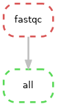
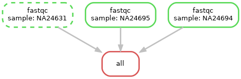

# 03 - Create a basic workflow

# Table of contents

- [03 - Create a basic workflow](#03---create-a-basic-workflow)
- [Table of contents](#table-of-contents)
  - [Aim](#aim)
  - [File structure](#file-structure)
  - [First rule](#first-rule)
  - [Run using the conda package management system](#run-using-the-conda-package-management-system)
  - [Capture our logs](#capture-our-logs)
  - [Scale up to analyse all of our samples](#scale-up-to-analyse-all-of-our-samples)
  - [Add more rules](#add-more-rules)
  - [Add even more rules](#add-even-more-rules)
  - [Throw it more cores](#throw-it-more-cores)
- [Takeaways](#takeaways)
- [Summary commands](#summary-commands)
- [Our final snakemake workflow!](#our-final-snakemake-workflow)

## Aim

---

*Let's create a basic workflow that will do some of the typical quality control checks, pre-processing and mapping to a reference genome that is undertaken on paired-end sequence data*

input data :arrow_right: [fastqc](https://www.bioinformatics.babraham.ac.uk/projects/fastqc/) :arrow_right: [multiqc](https://multiqc.info/) <br />
input data :arrow_right: [trim_galore](https://www.bioinformatics.babraham.ac.uk/projects/trim_galore/) :arrow_right: [bwa](http://bio-bwa.sourceforge.net/) <br />

---

We have paired end sequencing data for three samples `NA24631` to process in the `./data` directory. Let's have a look:

```bash
ls -lh ./data/
```

Output:

```bash
-rw-rw-r-- 1 lkemp lkemp 2.1M Nov 18 14:56 NA24631_1.fastq.gz
-rw-rw-r-- 1 lkemp lkemp 2.3M Nov 18 14:56 NA24631_2.fastq.gz
-rw-rw-r-- 1 lkemp lkemp 2.1M Nov 18 14:56 NA24694_1.fastq.gz
-rw-rw-r-- 1 lkemp lkemp 2.3M Nov 18 14:56 NA24694_2.fastq.gz
-rw-rw-r-- 1 lkemp lkemp 1.8M Nov 18 14:56 NA24695_1.fastq.gz
-rw-rw-r-- 1 lkemp lkemp 1.9M Nov 18 14:56 NA24695_2.fastq.gz
```

## File structure

Workflow file structure:

```bash
demo_workflow/
      |_______results/
      |_______workflow/
                 |_______envs/
                 |_______Snakefile
```

We will work in the `workflow` directory send all of our file outputs/results to the `results/` directory

*Read up on the best practice workflow structure [here](https://snakemake.readthedocs.io/en/stable/snakefiles/deployment.html#distribution-and-reproducibility)*

Create this file structure and our main Snakefile with:

```bash
mkdir -p demo_workflow/{results,workflow/envs}
touch demo_workflow/workflow/Snakefile
```

## First rule

First lets run the first step ([fastqc](https://www.bioinformatics.babraham.ac.uk/projects/fastqc/)) directly on the command line to get the syntax of the command right and check what outputs files we expect to get

```bash
# Install fastqc
conda install fastqc

# See what parameters are availble
fastqc --help

# Create a test directory
mkdir test

# Directly run fastqc on the command line
fastqc ./data/NA24631_1.fastq.gz ./data/NA24631_2.fastq.gz -o ./test -t 8
```

What are the output files of fastqc? Find out with:

```bash
ls -lh ./test
```

My output:

```bash
-rw-rw-r-- 1 lkemp lkemp 250K Nov 18 15:53 NA24631_1_fastqc.html
-rw-rw-r-- 1 lkemp lkemp 327K Nov 18 15:53 NA24631_1_fastqc.zip
-rw-rw-r-- 1 lkemp lkemp 249K Nov 18 15:53 NA24631_2_fastqc.html
-rw-rw-r-- 1 lkemp lkemp 327K Nov 18 15:53 NA24631_2_fastqc.zip
```

Let's wrap this up in a Snakemake workflow! Start with the basic structure in the Snakefile:

```diff
# Target rules
rule all:
    input:

# Workflow
rule my_rule:
    input:
        ""
    output:
        ""
    threads:
    shell:
        ""
```

- Name the rule
- Fill in the the input fastq files from the `data` directory (path relative to the Snakefile)
- Fill in the output files (now you can see it's useful to know what files fasqtc outputs!)
- Set the number of threads
- Write the shell command and pass these variables to the shell command
- Set the final output files (`rule all:`)

```diff
# Targets
rule all:
    input:
+         "../results/fastqc/NA24631_1_fastqc.html",
+         "../results/fastqc/NA24631_2_fastqc.html",
+         "../results/fastqc/NA24631_1_fastqc.zip",
+         "../results/fastqc/NA24631_2_fastqc.zip"

# Workflow
+ rule fastqc:
      input:
+         R1 = "../../data/NA24631_1.fastq.gz",
+         R2 = "../../data/NA24631_2.fastq.gz"
      output:
+         html = ["../results/fastqc/NA24631_1_fastqc.html", "../results/fastqc/NA24631_2_fastqc.html"],
+         zip = ["../results/fastqc/NA24631_1_fastqc.zip", "../results/fastqc/NA24631_2_fastqc.zip"]
+     threads: 8
      shell:
+         "fastqc {input.R1} {input.R2} -o ../results/fastqc/ -t {threads}"
```

Let's test the workflow! First we need to be in the `workflow` directory where the Snakefile is

```bash 
cd demo_workflow/workflow/
```

Then let's carry out a dryrun of the workflow, where no actual analysis is undertaken (fastqc is *not* run) but the overall Snakemake structure is run/validated. This is a good way to check for errors in your Snakemake workflow before actually running your workflow.

```bash
snakemake -n --cores 8
```

Output:

```bash
Building DAG of jobs...
Job counts:
        count   jobs
        1       all
        1       fastqc
        2

[Wed Nov 18 17:08:08 2020]
rule fastqc:
    input: ../../data/NA24631_1.fastq.gz, ../../data/NA24631_2.fastq.gz
    output: ../results/fastqc/NA24631_1_fastqc.html, ../results/fastqc/NA24631_2_fastqc.html, ../results/fastqc/NA24631_1_fastqc.zip, ../results/fastqc/NA24631_2_fastqc.zip
    jobid: 1
    threads: 8


[Wed Nov 18 17:08:08 2020]
localrule all:
    input: ../results/fastqc/NA24631_1_fastqc.html, ../results/fastqc/NA24631_2_fastqc.html, ../results/fastqc/NA24631_1_fastqc.zip, ../results/fastqc/NA24631_2_fastqc.zip
    jobid: 0

Job counts:
        count   jobs
        1       all
        1       fastqc
        2
This was a dry-run (flag -n). The order of jobs does not reflect the order of execution.
```

The output confirms that the workflow will run one sample (`count 1`) through `jobs fastqc`

We can also visualise our workflow by creating a diagram of jobs (DAG)

```bash
snakemake --dag | dot -Tpng > dag_1.png
```


*Note. this diagram can be output to several other image formats such as svg or pdf*

Let's do a full run of our workflow (by removing the `-n` flag)

```bash
snakemake --cores 8
```

Output:

```bash
Building DAG of jobs...
Using shell: /bin/bash
Provided cores: 8
Rules claiming more threads will be scaled down.
Job counts:
        count   jobs
        1       all
        1       fastqc
        2

[Fri Nov 20 18:46:27 2020]
rule fastqc:
    input: ../../data/NA24631_1.fastq.gz, ../../data/NA24631_2.fastq.gz
    output: ../results/fastqc/NA24631_1_fastqc.html, ../results/fastqc/NA24631_2_fastqc.html, ../results/fastqc/NA24631_1_fastqc.zip, ../results/fastqc/NA24631_2_fastqc.zip
    jobid: 1
    threads: 8

Started analysis of NA24631_1.fastq.gz
Approx 5% complete for NA24631_1.fastq.gz
Approx 10% complete for NA24631_1.fastq.gz
Approx 15% complete for NA24631_1.fastq.gz
Approx 20% complete for NA24631_1.fastq.gz
Approx 25% complete for NA24631_1.fastq.gz
Approx 30% complete for NA24631_1.fastq.gz
Approx 35% complete for NA24631_1.fastq.gz
Approx 40% complete for NA24631_1.fastq.gz
Approx 45% complete for NA24631_1.fastq.gz
Approx 50% complete for NA24631_1.fastq.gz
Approx 55% complete for NA24631_1.fastq.gz
Started analysis of NA24631_2.fastq.gz
Approx 60% complete for NA24631_1.fastq.gz
Approx 65% complete for NA24631_1.fastq.gz
Approx 5% complete for NA24631_2.fastq.gz
Approx 10% complete for NA24631_2.fastq.gz
Approx 70% complete for NA24631_1.fastq.gz
Approx 75% complete for NA24631_1.fastq.gz
Approx 15% complete for NA24631_2.fastq.gz
Approx 20% complete for NA24631_2.fastq.gz
Approx 80% complete for NA24631_1.fastq.gz
Approx 25% complete for NA24631_2.fastq.gz
Approx 85% complete for NA24631_1.fastq.gz
Approx 30% complete for NA24631_2.fastq.gz
Approx 90% complete for NA24631_1.fastq.gz
Approx 35% complete for NA24631_2.fastq.gz
Approx 95% complete for NA24631_1.fastq.gz
Approx 40% complete for NA24631_2.fastq.gz
Analysis complete for NA24631_1.fastq.gz
Approx 45% complete for NA24631_2.fastq.gz
Approx 50% complete for NA24631_2.fastq.gz
Approx 55% complete for NA24631_2.fastq.gz
Approx 60% complete for NA24631_2.fastq.gz
Approx 65% complete for NA24631_2.fastq.gz
Approx 70% complete for NA24631_2.fastq.gz
Approx 75% complete for NA24631_2.fastq.gz
Approx 80% complete for NA24631_2.fastq.gz
Approx 85% complete for NA24631_2.fastq.gz
Approx 90% complete for NA24631_2.fastq.gz
Approx 95% complete for NA24631_2.fastq.gz
Analysis complete for NA24631_2.fastq.gz
[Fri Nov 20 18:46:33 2020]
Finished job 1.
1 of 2 steps (50%) done

[Fri Nov 20 18:46:33 2020]
localrule all:
    input: ../results/fastqc/NA24631_1_fastqc.html, ../results/fastqc/NA24631_2_fastqc.html, ../results/fastqc/NA24631_1_fastqc.zip, ../results/fastqc/NA24631_2_fastqc.zip
    jobid: 0

[Fri Nov 20 18:46:33 2020]
Finished job 0.
2 of 2 steps (100%) done
Complete log: /home/lkemp/RezBaz2020_snakemake_workshop/demo_workflow/workflow/.snakemake/log/2020-11-20T184627.461379.snakemake.log
```

It worked! Now in our results directory we have our output files from fastqc. Let's have a look:

```bash
ls -lh ../results/fastqc/
```

Output

```bash
total 2.4M
-rw-rw-r-- 1 lkemp lkemp 718K Nov 20 18:46 NA24631_1_fastqc.html
-rw-rw-r-- 1 lkemp lkemp 475K Nov 20 18:46 NA24631_1_fastqc.zip
-rw-rw-r-- 1 lkemp lkemp 726K Nov 20 18:46 NA24631_2_fastqc.html
-rw-rw-r-- 1 lkemp lkemp 479K Nov 20 18:46 NA24631_2_fastqc.zip
```

What happens if we try a dryrun or full run now?

```bash
snakemake -n --cores 8
snakemake --cores 8
```

Output

```bash
Building DAG of jobs...
Nothing to be done.
```

Nothing happens, all the target files in `rule all` have already been created so Snakemake does nothing

## Run using the conda package management system

fastqc worked because we already had it installed locally. Let's specify a conda environment for fastqc so the user of the workflow doesn't need to install it manually.

Make a conda environment file for fastqc

```bash
# Create the file
touch ./envs/fastqc.yaml

# See what versions of fastqc are available
conda search fastqc

# Write the following to fastqc.yaml
channels:
  - bioconda
  - conda-forge
  - defaults
dependencies:
  - bioconda::fastqc=0.11.9
```

Update our rule to use it using the `conda:` directive

```diff
# Targets
rule all:
    input:
        "../results/fastqc/NA24631_1_fastqc.html",
        "../results/fastqc/NA24631_2_fastqc.html",
        "../results/fastqc/NA24631_1_fastqc.zip",
        "../results/fastqc/NA24631_2_fastqc.zip"

# Workflow
rule fastqc:
    input:
        R1 = "../../data/NA24631_1.fastq.gz",
        R2 = "../../data/NA24631_2.fastq.gz"
    output:
        html = ["../results/fastqc/NA24631_1_fastqc.html", "../results/fastqc/NA24631_2_fastqc.html"],
        zip = ["../results/fastqc/NA24631_1_fastqc.zip", "../results/fastqc/NA24631_2_fastqc.zip"]
    threads: 8
+   conda:
+       "envs/fastqc.yaml"
    shell:
        "fastqc {input.R1} {input.R2} -o ../results/fastqc/ -t {threads}"
```

Run again, now telling Snakemake to use to use [Conda](https://docs.conda.io/en/latest/) to get our software by using the `--use-conda` flag

```diff
# Remove output of last run
rm -r ../results/*

# Run dryrun/run again
+ snakemake -n --cores 8 --use-conda
+ snakemake --cores 8 --use-conda
```

## Capture our logs

So far our logs (for fastqc) have been simply printed to our screen. As you can imagine, if you had a large automated workflow (that you might not be sitting there watching run) you'll want to capture all that information. Therefore, any information the software spits out (including error messages!) will be kept and can be looked at once you return to your machine from your coffee break. 

We can get the logs for each rule to be written to a log file via the `log:` directive:

- It's a good idea to organise the logs by:
  - Putting the logs in a directory labelled after the rule/software 
  - Labelling the log files with the sample name

- Also make sure you tell the software (fastqc) to write the standard output and standard error to this log file we defined in the `log:` directive

```diff
# Targets
rule all:
    input:
        "../results/fastqc/NA24631_1_fastqc.html",
        "../results/fastqc/NA24631_2_fastqc.html",
        "../results/fastqc/NA24631_1_fastqc.zip",
        "../results/fastqc/NA24631_2_fastqc.zip"

# Workflow
rule fastqc:
    input:
        R1 = "../../data/NA24631_1.fastq.gz",
        R2 = "../../data/NA24631_2.fastq.gz"
    output:
        html = ["../results/fastqc/NA24631_1_fastqc.html", "../results/fastqc/NA24631_2_fastqc.html"],
        zip = ["../results/fastqc/NA24631_1_fastqc.zip", "../results/fastqc/NA24631_2_fastqc.zip"]
+   log:
+       "logs/fastqc/NA24631.log"
    threads: 8
    conda:
        "envs/fastqc.yaml"
    shell:
-       "fastqc {input.R1} {input.R2} -o ../results/fastqc/ -t {threads}"
+       "fastqc {input.R1} {input.R2} -o ../results/fastqc/ -t {threads} &> {log}"
```

A note on standard outputs and standard errors

- For linux, these are standard streams in which information is returned by a computer process - in our case the logs that we see returned to us on our screen when we run fastqc
- There are two main streams:
  - standard output (the log messages)
  - standard error (the error messages)

```bash
# Standard error
Started analysis of NA24631_1.fastq.gz
Approx 5% complete for NA24631_1.fastq.gz
Approx 10% complete for NA24631_1.fastq.gz
Approx 15% complete for NA24631_1.fastq.gz
Approx 20% complete for NA24631_1.fastq.gz
Approx 25% complete for NA24631_1.fastq.gz
Approx 30% complete for NA24631_1.fastq.gz
Approx 35% complete for NA24631_1.fastq.gz
Approx 40% complete for NA24631_1.fastq.gz
Approx 45% complete for NA24631_1.fastq.gz
Approx 50% complete for NA24631_1.fastq.gz
Started analysis of NA24631_2.fastq.gz
Approx 55% complete for NA24631_1.fastq.gz
Approx 5% complete for NA24631_2.fastq.gz
Approx 60% complete for NA24631_1.fastq.gz
Approx 10% complete for NA24631_2.fastq.gz
Approx 65% complete for NA24631_1.fastq.gz
Approx 15% complete for NA24631_2.fastq.gz
Approx 70% complete for NA24631_1.fastq.gz
Approx 20% complete for NA24631_2.fastq.gz
Approx 75% complete for NA24631_1.fastq.gz
Approx 25% complete for NA24631_2.fastq.gz
Approx 80% complete for NA24631_1.fastq.gz
Approx 30% complete for NA24631_2.fastq.gz
Approx 85% complete for NA24631_1.fastq.gz
Approx 35% complete for NA24631_2.fastq.gz
Approx 90% complete for NA24631_1.fastq.gz
Approx 40% complete for NA24631_2.fastq.gz
Approx 95% complete for NA24631_1.fastq.gz
Analysis complete for NA24631_1.fastq.gz
Approx 45% complete for NA24631_2.fastq.gz
Approx 50% complete for NA24631_2.fastq.gz
Approx 55% complete for NA24631_2.fastq.gz
Approx 60% complete for NA24631_2.fastq.gz
Approx 65% complete for NA24631_2.fastq.gz
Approx 70% complete for NA24631_2.fastq.gz
Approx 75% complete for NA24631_2.fastq.gz
Approx 80% complete for NA24631_2.fastq.gz
Approx 85% complete for NA24631_2.fastq.gz
Approx 90% complete for NA24631_2.fastq.gz
Approx 95% complete for NA24631_2.fastq.gz
Analysis complete for NA24631_2.fastq.gz
```

```bash
# Standard error
Failed to process ../results/fastqc
java.io.FileNotFoundException: ../results/fastqc (Is a directory)
        at java.io.FileInputStream.open0(Native Method)
        at java.io.FileInputStream.open(FileInputStream.java:195)
        at java.io.FileInputStream.<init>(FileInputStream.java:138)
        at uk.ac.babraham.FastQC.Sequence.FastQFile.<init>(FastQFile.java:73)
        at uk.ac.babraham.FastQC.Sequence.SequenceFactory.getSequenceFile(SequenceFactory.java:106)
        at uk.ac.babraham.FastQC.Sequence.SequenceFactory.getSequenceFile(SequenceFactory.java:62)
        at uk.ac.babraham.FastQC.Analysis.OfflineRunner.processFile(OfflineRunner.java:152)
        at uk.ac.babraham.FastQC.Analysis.OfflineRunner.<init>(OfflineRunner.java:121)
        at uk.ac.babraham.FastQC.FastQCApplication.main(FastQCApplication.java:316)
```

Different ways to write log files:


|  Syntax  | standard output in terminal | standard error in terminal | standard output in file | standard error in file |
|----------|-----------------------------|----------------------------|-------------------------|------------------------|
|   `>`    |  :x:                        | :heavy_check_mark:         | :heavy_check_mark:      | :x:                    |
|   `2>`   |  :heavy_check_mark:         | :x:                        | :x:                     | :heavy_check_mark:     |
|   `&>`   |  :x:                        | :x:                        | :heavy_check_mark:      | :heavy_check_mark:     |

(Table adapted from [here](https://askubuntu.com/questions/420981/how-do-i-save-terminal-output-to-a-file))

Run again

```bash
# Remove output of last run
rm -r ../results/*

# Run dryrun/run again
snakemake -n --cores 8 --use-conda
snakemake --cores 8 --use-conda
```

We now have a log file, lets have a look at the first 10 lines of our log with:

```bash
head ./logs/fastqc/NA24631.log
```

Output:

```bash
Started analysis of NA24631_1.fastq.gz
Approx 5% complete for NA24631_1.fastq.gz
Approx 10% complete for NA24631_1.fastq.gz
Approx 15% complete for NA24631_1.fastq.gz
Approx 20% complete for NA24631_1.fastq.gz
Approx 25% complete for NA24631_1.fastq.gz
Approx 30% complete for NA24631_1.fastq.gz
Approx 35% complete for NA24631_1.fastq.gz
Approx 40% complete for NA24631_1.fastq.gz
Approx 45% complete for NA24631_1.fastq.gz
```

<p align="center"><b>We have logs. Tidy logs.</b><br></p>


## Scale up to analyse all of our samples

We are currently only analysing one of our three samples

Let's scale up to run all of our samples by using [wildcards](https://snakemake.readthedocs.io/en/stable/snakefiles/rules.html#wildcards), this way we can grab all the samples/files in the `data` directory and analyse them

- Set a global wildcard that defines the samples to be analysed
- Generalise where this rule uses an individual sample (`NA24631`) to use this wildcard `{sample}`
- Use the [expand function](https://snakemake.readthedocs.io/en/stable/snakefiles/rules.html#the-expand-function) (`expand()`) function to tell snakemake that `{sample}` is what we defined in our global wildcard `SAMPLES,`
- Snakemake can figure out what `{sample}` is in our rule since it's defined in the targets in `rule all:`

```diff
# Define samples from data directory using wildcards
+ SAMPLES, = glob_wildcards("../../data/{sample}_1.fastq.gz")

# Targets
rule all:
    input:
+       expand("../results/fastqc/{sample}_1_fastqc.html", sample = SAMPLES),
+       expand("../results/fastqc/{sample}_2_fastqc.html", sample = SAMPLES),
+       expand("../results/fastqc/{sample}_1_fastqc.zip", sample = SAMPLES),
+       expand("../results/fastqc/{sample}_2_fastqc.zip", sample = SAMPLES)

# Workflow
rule fastqc:
    input:
+       R1 = "../../data/{sample}_1.fastq.gz",
+       R2 = "../../data/{sample}_2.fastq.gz"
    output:
+       html = ["../results/fastqc/{sample}_1_fastqc.html", "../results/fastqc/{sample}_2_fastqc.html"],
+       zip = ["../results/fastqc/{sample}_1_fastqc.zip", "../results/fastqc/{sample}_2_fastqc.zip"]
    log:
+       "logs/fastqc/{sample}.log"
    threads: 8
    conda:
        "envs/fastqc.yaml"
    shell:
        "fastqc {input.R1} {input.R2} -o ../results/fastqc/ -t {threads} &> {log}"
```

Visualise workflow

```bash
snakemake --dag | dot -Tpng > dag_2.png
```

Now we have three samples running though our workflow



Run workflow again

```bash
# Remove output of last run
rm -r ../results/*

# Run dryrun/run again
snakemake -n --cores 8 --use-conda
snakemake --cores 8 --use-conda
```

All three samples were run through our workflow! And we have a log file for each sample for the fastqc rule

```bash
ls -lh ./logs/fastqc
```

Output:

```bash
-rw-rw-r-- 1 lkemp lkemp 1.8K Nov 19 15:17 NA24631.log
-rw-rw-r-- 1 lkemp lkemp 1.8K Nov 19 15:17 NA24694.log
-rw-rw-r-- 1 lkemp lkemp 1.8K Nov 19 15:17 NA24695.log
```

## Add more rules

- Make a conda environment file for multiqc

```bash
# Create the file
touch ./envs/multiqc.yaml

# See what versions of multiqc are available
conda search multiqc

# Write the following to multiqc.yaml
channels:
  - bioconda
  - conda-forge
  - defaults
dependencies:
  - bioconda::multiqc=1.9
```

- Connect the outputs of fastqc to the inputs of multiqc
- Add a new final target for `rule all:`

```diff
# Define samples from data directory using wildcards
SAMPLES, = glob_wildcards("../../data/{sample}_1.fastq.gz")

# Targets
rule all:
    input:
        expand("../results/fastqc/{sample}_1_fastqc.html", sample = SAMPLES),
        expand("../results/fastqc/{sample}_2_fastqc.html", sample = SAMPLES),
        expand("../results/fastqc/{sample}_1_fastqc.zip", sample = SAMPLES),
        expand("../results/fastqc/{sample}_2_fastqc.zip", sample = SAMPLES),
+       "../results/multiqc_report.html"

# Workflow
rule fastqc:
    input:
        R1 = "../../data/{sample}_1.fastq.gz",
        R2 = "../../data/{sample}_2.fastq.gz"
    output:
        html = ["../results/fastqc/{sample}_1_fastqc.html", "../results/fastqc/{sample}_2_fastqc.html"],
        zip = ["../results/fastqc/{sample}_1_fastqc.zip", "../results/fastqc/{sample}_2_fastqc.zip"]
    log:
        "logs/fastqc/{sample}.log"
    threads: 8
    conda:
        "envs/fastqc.yaml"
    shell:
        "fastqc {input.R1} {input.R2} -o ../results/fastqc/ -t {threads} &> {log}"
  
+ rule multiqc:
+     input:
+         ["../results/fastqc/{sample}_1_fastqc.zip", "../results/fastqc/{sample}_2_fastqc.zip"]
+     output:
+         "../results/multiqc_report.html"
+     conda:
+         "envs/multiqc.yaml"
+     log:
+         "logs/multiqc/multiqc.log"
+     shell:
+         "multiqc {input} -o ../results/ &> {log}"
```

Run workflow again

```bash
# Remove output of last run
rm -r ../results/*

# Run dryrun/run again
snakemake -n --cores 8 --use-conda
snakemake --cores 8 --use-conda
```

Didn't work? Error:

```bash
Building DAG of jobs...
WildcardError in line 30 of /home/lkemp/RezBaz2020/demo_workflow/workflow/Snakefile:
Wildcards in input files cannot be determined from output files:
'sample'
```

Since we haven't defined `{sample}` in `rule all:` for multiqc, we need to define it somewhere! Let do so in the multiqc rule

```diff
# Define samples from data directory using wildcards
SAMPLES, = glob_wildcards("../../data/{sample}_1.fastq.gz")

# Targets
rule all:
    input:
        expand("../results/fastqc/{sample}_1_fastqc.html", sample = SAMPLES),
        expand("../results/fastqc/{sample}_2_fastqc.html", sample = SAMPLES),
        expand("../results/fastqc/{sample}_1_fastqc.zip", sample = SAMPLES),
        expand("../results/fastqc/{sample}_2_fastqc.zip", sample = SAMPLES),
        "../results/multiqc_report.html"

# Workflow
rule fastqc:
    input:
        R1 = "../../data/{sample}_1.fastq.gz",
        R2 = "../../data/{sample}_2.fastq.gz"
    output:
        html = ["../results/fastqc/{sample}_1_fastqc.html", "../results/fastqc/{sample}_2_fastqc.html"],
        zip = ["../results/fastqc/{sample}_1_fastqc.zip", "../results/fastqc/{sample}_2_fastqc.zip"]
    log:
        "logs/fastqc/{sample}.log"
    threads: 8
    conda:
        "envs/fastqc.yaml"
    shell:
        "fastqc {input.R1} {input.R2} -o ../results/fastqc/ -t {threads} &> {log}"
  
rule multiqc:
    input:
-       ["../results/fastqc/{sample}_1_fastqc.zip", "../results/fastqc/{sample}_2_fastqc.zip"]
+       expand(["../results/fastqc/{sample}_1_fastqc.zip", "../results/fastqc/{sample}_2_fastqc.zip"], sample = SAMPLES)
    output:
        "../results/multiqc_report.html"
    conda:
        "envs/multiqc.yaml"
    log:
        "logs/multiqc/multiqc.log"
    shell:
        "multiqc {input} -o ../results/ &> {log}"
```

Visualise workflow

```bash
snakemake --dag | dot -Tpng > dag_3.png
```

Now we have two rules in our workflow (fastqc and multiqc), we can also see that multiqc isn't run for each sample (since it merges the output of fastqc for all samples)



Run again

```bash
# Remove output of last run
rm -r ../results/*

# Run dryrun/run again
snakemake -n --cores 8 --use-conda
snakemake --cores 8 --use-conda
```

What happens if we only have the final target file (`../results/multiqc_report.html`) in `rule all:`

```diff
# Define samples from data directory using wildcards
SAMPLES, = glob_wildcards("../../data/{sample}_1.fastq.gz")

# Targets
rule all:
    input:
-       expand("../results/fastqc/{sample}_1_fastqc.html", sample = SAMPLES),
-       expand("../results/fastqc/{sample}_2_fastqc.html", sample = SAMPLES),
-       expand("../results/fastqc/{sample}_1_fastqc.zip", sample = SAMPLES),
-       expand("../results/fastqc/{sample}_2_fastqc.zip", sample = SAMPLES),
       "../results/multiqc_report.html"

# Workflow
rule fastqc:
    input:
        R1 = "../../data/{sample}_1.fastq.gz",
        R2 = "../../data/{sample}_2.fastq.gz"
    output:
        html = ["../results/fastqc/{sample}_1_fastqc.html", "../results/fastqc/{sample}_2_fastqc.html"],
        zip = ["../results/fastqc/{sample}_1_fastqc.zip", "../results/fastqc/{sample}_2_fastqc.zip"]
    log:
        "logs/fastqc/{sample}.log"
    threads: 8
    conda:
        "envs/fastqc.yaml"
    shell:
        "fastqc {input.R1} {input.R2} -o ../results/fastqc/ -t {threads} &> {log}"
  
rule multiqc:
    input:
        expand(["../results/fastqc/{sample}_1_fastqc.zip", "../results/fastqc/{sample}_2_fastqc.zip"], sample = SAMPLES)
    output:
        "../results/multiqc_report.html"
    conda:
        "envs/multiqc.yaml"
    log:
        "logs/multiqc/multiqc.log"
    shell:
        "multiqc {input} -o ../results/ &> {log}"
```

Run workflow again

```bash
# Remove output of last run
rm -r ../results/*

# Run dryrun/run again
snakemake -n --cores 8 --use-conda
snakemake --cores 8 --use-conda
```

It still works because it is the last file in the workflow sequence, Snakemake will do all the steps necessary to get to this target file (therefore it runs fastqc and multiqc)

Visualise workflow

```bash
snakemake --dag | dot -Tpng > dag_4.png
```

Although the workflow ran the same, the DAG actually changed slightly, now there is only one file target and only the output of multiqc goes to `rule all`


**Beware: Snakemake will also NOT run rules that is doesn't need to run in order to get the target files defined in rule: all**

For example if only our fastqc outputs are defined as the target in `rule: all`

```diff
# Define samples from data directory using wildcards
SAMPLES, = glob_wildcards("../../data/{sample}_1.fastq.gz")

# Targets
rule all:
    input:
+       expand("../results/fastqc/{sample}_1_fastqc.html", sample = SAMPLES),
+       expand("../results/fastqc/{sample}_2_fastqc.html", sample = SAMPLES),
+       expand("../results/fastqc/{sample}_1_fastqc.zip", sample = SAMPLES),
+       expand("../results/fastqc/{sample}_2_fastqc.zip", sample = SAMPLES)
-       "../results/multiqc_report.html"

# Workflow
rule fastqc:
    input:
        R1 = "../../data/{sample}_1.fastq.gz",
        R2 = "../../data/{sample}_2.fastq.gz"
    output:
        html = ["../results/fastqc/{sample}_1_fastqc.html", "../results/fastqc/{sample}_2_fastqc.html"],
        zip = ["../results/fastqc/{sample}_1_fastqc.zip", "../results/fastqc/{sample}_2_fastqc.zip"]
    log:
        "logs/fastqc/{sample}.log"
    threads: 8
    conda:
        "envs/fastqc.yaml"
    shell:
        "fastqc {input.R1} {input.R2} -o ../results/fastqc/ -t {threads} &> {log}"
  
rule multiqc:
    input:
        expand(["../results/fastqc/{sample}_1_fastqc.zip", "../results/fastqc/{sample}_2_fastqc.zip"], sample = SAMPLES)
    output:
        "../results/multiqc_report.html"
    conda:
        "envs/multiqc.yaml"
    log:
        "logs/multiqc/multiqc.log"
    shell:
        "multiqc {input} -o ../results/ &> {log}"
```

Run again

```bash
# Remove output of last run
rm -r ../results/*

# Run dryrun/run again
snakemake -n --cores 8 --use-conda
snakemake --cores 8 --use-conda
```

Output:

```bash
Job counts:
        count   jobs
        1       all
        3       fastqc
        4
This was a dry-run (flag -n). The order of jobs does not reflect the order of execution.
```

Our multiqc rule won't be run/evaluated

Visualise workflow

```bash
snakemake --dag | dot -Tpng > dag_5.png
```

Now we are back to only running fastqc in our workflow, despite having our second rule (multiqc) in our workflow


<p align="center"><b>Snakemake is lazy.</b><br></p>


## Add even more rules

Let's add the rest of the rules, currently we have:

input data :arrow_right: [fastqc](https://www.bioinformatics.babraham.ac.uk/projects/fastqc/) :arrow_right: [multiqc](https://multiqc.info/) :heavy_check_mark:

We still need to add:

input data :arrow_right: [trim_galore](https://www.bioinformatics.babraham.ac.uk/projects/trim_galore/) :arrow_right: [bwa](http://bio-bwa.sourceforge.net/)

```diff
# Define samples from data directory using wildcards
SAMPLES, = glob_wildcards("../../data/{sample}_1.fastq.gz")

# Targets
rule all:
    input:
-       expand("../results/fastqc/{sample}_1_fastqc.html", sample = SAMPLES),
-       expand("../results/fastqc/{sample}_2_fastqc.html", sample = SAMPLES),
-       expand("../results/fastqc/{sample}_1_fastqc.zip", sample = SAMPLES),
-       expand("../results/fastqc/{sample}_2_fastqc.zip", sample = SAMPLES)
+       "../results/multiqc_report.html",
+       expand("../results/mapped/{sample}.bam", sample = SAMPLES)

# Workflow
rule fastqc:
    input:
        R1 = "../../data/{sample}_1.fastq.gz",
        R2 = "../../data/{sample}_2.fastq.gz"
    output:
        html = ["../results/fastqc/{sample}_1_fastqc.html", "../results/fastqc/{sample}_2_fastqc.html"],
        zip = ["../results/fastqc/{sample}_1_fastqc.zip", "../results/fastqc/{sample}_2_fastqc.zip"]
    log:
        "logs/fastqc/{sample}.log"
    threads: 8
    conda:
        "envs/fastqc.yaml"
    shell:
        "fastqc {input.R1} {input.R2} -o ../results/fastqc/ -t {threads} &> {log}"
  
rule multiqc:
    input:
        expand(["../results/fastqc/{sample}_1_fastqc.zip", "../results/fastqc/{sample}_2_fastqc.zip"], sample = SAMPLES)
    output:
        "../results/multiqc_report.html"
    conda:
        "envs/multiqc.yaml"
    log:
        "logs/multiqc/multiqc.log"
    shell:
        "multiqc {input} -o ../results/ &> {log}"

+ rule trim_galore:
+     input:
+         ["../../data/{sample}_1.fastq.gz", "../../data/{sample}_2.fastq.gz"]
+     output:
+         ["../results/trimmed/{sample}_1_val_1.fq.gz", "../results/trimmed/{sample}_2_val_2.fq.gz"]
+     log:
+         "logs/trim_galore/{sample}.log"
+     conda:
+         "./envs/trim_galore.yaml"
+     threads: 8
+     shell:
+         "trim_galore {input} -o ../results/trimmed/ --paired --cores {threads} &> {log}"

+ rule bwa:
+     input:
+         fastq = ["../results/trimmed/{sample}_1_val_1.fq.gz", "../results/trimmed/{sample}_2_val_2.fq.gz"],
+         refgenome = "/store/lkemp/publicData/b37/human_g1k_v37_decoy.fasta"
+     output: 
+         "../results/mapped/{sample}.bam"
+     log:
+         "logs/bwa_mem/{sample}.log"
+     conda:
+         "./envs/bwa.yaml"
+     threads: 8
+     shell:
+         "bwa mem -t {threads} {input.refgenome} {input.fastq} > {output} 2> {log}"
```

Create conda env files

```bash
# Create file
touch ./envs/trim_galore.yaml

# Write the following to trim_galore.yaml
channels:
  - bioconda
  - conda-forge
  - defaults
dependencies:
  - bioconda::trim-galore=0.6.5

# Create file
touch ./envs/bwa.yaml

# Write the following to bwa.yaml
channels:
  - bioconda
  - conda-forge
  - defaults
dependencies:
  - bioconda::bwa=0.7.17
  - bioconda::gatk4=4.1.6.0
```

Visualise workflow

```bash
snakemake --dag | dot -Tpng > dag_6.png
```

Fantastic, we are starting to build a workflow!


However, when analysing many samples, our DAG can become messy and complicated. Instead, we can create a rulegraph that will let us visualise our workflow without showing every single sample that will run through it

```bash
snakemake --rulegraph | dot -Tpng > rulegraph_1.png
```


An aside: another option that will show all your input and output files at each step:

```bash
snakemake --filegraph | dot -Tpng > filegraph.png
```


Run the workflow again

```bash
# Remove output of last run
rm -r ../results/*

# Run dryrun/run again
snakemake -n --cores 8 --use-conda
snakemake --cores 8 --use-conda
```

Notice it will run only one rule/sample at a time...why is that?

## Throw it more cores

Run again allowing Snakemake to use more cores overall `--cores 32` rather than `--cores 8`

```bash
# Remove output of last run
rm -r ../results/*

# Run dryrun/run again
snakemake -n --cores 32 --use-conda
snakemake --cores 32 --use-conda
```

<p align="center"><b>Now more steps can be run at one time - parallel computing here we come!</b><br></p>


# Takeaways

---

- Run your commands directly on the command line before wrapping it up in a Snakemake rule
- First do a dryrun with the `-n` flag to check the Snakemake structure is set up correctly
- Work iteratively (get each rule working before moving onto the next)
- File paths are relative to the Snakefile
- Run your workflow from where your Snakefile is
- Visualise your workflow by creating a DAG (diagram of jobs), a rulegraph or filegraph
- Use the `--use-conda` flag when using conda to install software in your workflow
- Snakemake is lazy...
  - It will only do something if it hasn't already done it
  - It will pick up where it left off, rather than run the whole workflow again
  - It *won't* do any steps that aren't necessary to get to the target files defined in `rule: all`
- `input:` `output:` `log:` and `threads:` directives need to be called in the `shell` directive
- Use `&> {log}` (or something similar) in the shell command to capture your log files
- Organise your log files by naming them after the rule that was run and sample that was analysed
- You don't need to specify all the target files in `rule all:`, the final file in a given chain of tasks will suffice
- We can massively speed up our analyses by running your sampled in parallel

---

# Summary commands

Create a diagram of jobs (DAG) with:

```bash
snakemake --dag | dot -Tpng > dag.png
```

Create a rulegraph with:

```bash
snakemake --rulegraph | dot -Tpng > rulegraph.png
```

Create a filegraph with:

```bash
snakemake --filegraph | dot -Tpng > filegraph.png
```

Run a dryrun of your snakemake workflow with:

```bash
snakemake -n --cores 8
```

Run your snakemake workflow with:

```bash
snakemake --cores 8
```

Run a dryrun of your snakemake workflow (using conda to install your software) with:

```bash
snakemake -n --cores 8 --use-conda
```

Run your snakemake workflow (using conda to install your software) with:

```bash
snakemake --cores 8 --use-conda
```

Create a global wildcard to get process all your samples in a directory with:

```bash
SAMPLES, = glob_wildcards("../relative/path/to/samples/{sample}_1.fastq.gz")
```

Combine this with the expand function to tell Snakemake to look at your global wildcard to figure out what you refer to as `{sample}` in your workflow

```bash
expand("../results/{sample}.bam", sample = SAMPLES)
```

Increase the number of samples that can be analysed at one time in your workflow by increasing the maximum number of cores with the `--cores` command

```bash
snakemake --cores 32 --use-conda
```

# Our final snakemake workflow!

See [basic_demo_workflow](../basic_demo_workflow) for the final Snakemake workflow we've created up to this point

<p align="center"><b><a href="https://github.com/leahkemp/RezBaz2020_snakemake_workshop/blob/master/workshop_material/04_leveling_up_your_workflow.md">Next page: 04 - Leveling up your workflow</a>
