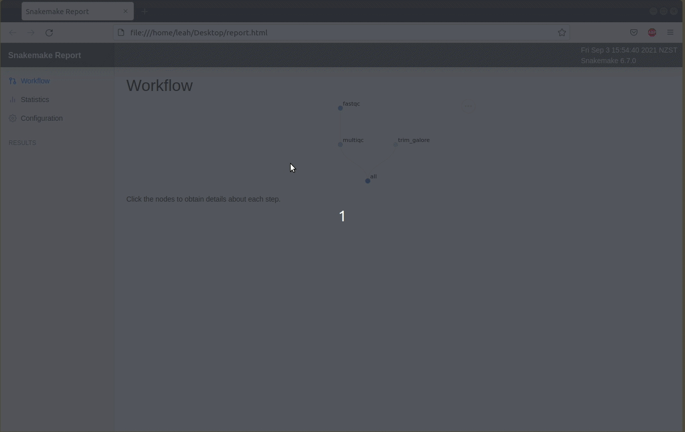

# 04 - Leveling up your workflow!

# Table of contents

- [04 - Leveling up your workflow!](#04---leveling-up-your-workflow)
- [Table of contents](#table-of-contents)
  - [Catching up](#catching-up)
  - [4.1 Use a profile for HPC](#41-use-a-profile-for-hpc)
  - [4.2 Pull out parameters](#42-pull-out-parameters)
  - [4.3 Pull out user configurable options](#43-pull-out-user-configurable-options)
  - [4.4 Leave messages for the user](#44-leave-messages-for-the-user)
  - [4.5 Create temporary files](#45-create-temporary-files)
  - [4.6 Generating a snakemake report](#46-generating-a-snakemake-report)
  - [4.7 Linting your workflow](#47-linting-your-workflow)
- [Takeaways](#takeaways)
- [Summary commands](#summary-commands)
- [Our final snakemake workflow!](#our-final-snakemake-workflow)

## Catching up

From section 03, your Snakefile should look like:

```python
# define samples from data directory using wildcards
SAMPLES, = glob_wildcards("../../data/{sample}_1.fastq.gz")

# target OUTPUT files for the whole workflow
rule all:
    input:
        "../results/multiqc_report.html",
        expand(["../results/trimmed/{sample}_1_val_1.fq.gz", "../results/trimmed/{sample}_2_val_2.fq.gz"], sample = SAMPLES)

# workflow
rule fastqc:
    input:
        R1 = "../../data/{sample}_1.fastq.gz",
        R2 = "../../data/{sample}_2.fastq.gz"
    output:
        html = ["../results/fastqc/{sample}_1_fastqc.html", "../results/fastqc/{sample}_2_fastqc.html"],
        zip = ["../results/fastqc/{sample}_1_fastqc.zip", "../results/fastqc/{sample}_2_fastqc.zip"]
    log:
        "logs/fastqc/{sample}.log"
    threads: 2
    conda:
        "envs/fastqc.yaml"
    shell:
        "fastqc {input.R1} {input.R2} -o ../results/fastqc/ -t {threads} &> {log}"
  
rule multiqc:
    input:
        expand(["../results/fastqc/{sample}_1_fastqc.zip", "../results/fastqc/{sample}_2_fastqc.zip"], sample = SAMPLES)
    output:
        "../results/multiqc_report.html"
    log:
        "logs/multiqc/multiqc.log"
    conda:
        "envs/multiqc.yaml"
    shell:
        "multiqc {input} -o ../results/ &> {log}"

rule trim_galore:
    input:
        ["../../data/{sample}_1.fastq.gz", "../../data/{sample}_2.fastq.gz"]
    output:
        ["../results/trimmed/{sample}_1_val_1.fq.gz", "../results/trimmed/{sample}_2_val_2.fq.gz"]
    log:
        "logs/trim_galore/{sample}.log"
    conda:
        "./envs/trim_galore.yaml"
    threads: 2
    shell:
        "trim_galore {input} -o ../results/trimmed/ --paired --cores {threads} &> {log}"
```

## 4.1 Use a profile for HPC

**TODO add link to 3.16**

In section 3.16, we have seen that a snakemake workflow can be run on an HPC cluster.
To reduce the boilerplate, we can use a [configuration profile](https://snakemake.readthedocs.io/en/stable/executing/cli.html#profiles) to configure default options.
In this case, we use it to set the `--cluster` and the `--jobs` options.

Make a `slurm` profile folder

```bash
# create the profile folder
mkdir slurm
touch slurm/config.yaml

# write the following to config.yaml
jobs: 20
cluster: "sbatch --time 00:10:00 --mem=512MB --cpus-per-task 8 --account nesi99991"
```

Then run the snakemake workflow using the `slurm` profile

```bash
# remove output of last run
rm -r ../results/*

# run dryrun/run again
snakemake --dryrun --profile slurm --use-conda
snakemake --profile slurm --use-conda
```

You can specify different resources (memory, cpus, gpus, etc.) for each target in the workflow and refer to them in the `cluster` option using placeholders.
Default resources for all rules can also be set using the `default-resources` option.

Update the profile `slurm/config.yaml` file as follows

```diff
jobs: 20
- cluster: "sbatch --time 00:10:00 --mem=512MB --cpus-per-task 8"
+ cluster: "sbatch --time {resources.time_min} --mem={resources.mem_mb} --cpus-per-task {resources.cpus} --account nesi99991"
+ default-resources: [cpus=2, mem_mb=512, time_min=10]
```

and add resources definitions in the workflow.
Here we give more CPU resources to `trim_galore` to make it run faster.

```diff
# define samples from data directory using wildcards
SAMPLES, = glob_wildcards("../../data/{sample}_1.fastq.gz")

# target OUTPUT files for the whole workflow
rule all:
    input:
        "../results/multiqc_report.html",
        expand(["../results/trimmed/{sample}_1_val_1.fq.gz", "../results/trimmed/{sample}_2_val_2.fq.gz"], sample = SAMPLES)

# workflow
rule fastqc:
    input:
        R1 = "../../data/{sample}_1.fastq.gz",
        R2 = "../../data/{sample}_2.fastq.gz"
    output:
        html = ["../results/fastqc/{sample}_1_fastqc.html", "../results/fastqc/{sample}_2_fastqc.html"],
        zip = ["../results/fastqc/{sample}_1_fastqc.zip", "../results/fastqc/{sample}_2_fastqc.zip"]
    log:
        "logs/fastqc/{sample}.log"
    threads: 2
    conda:
        "envs/fastqc.yaml"
    shell:
        "fastqc {input.R1} {input.R2} -o ../results/fastqc/ -t {threads} &> {log}"
  
rule multiqc:
    input:
        expand(["../results/fastqc/{sample}_1_fastqc.zip", "../results/fastqc/{sample}_2_fastqc.zip"], sample = SAMPLES)
    output:
        "../results/multiqc_report.html"
    log:
        "logs/multiqc/multiqc.log"
    conda:
        "envs/multiqc.yaml"
    shell:
        "multiqc {input} -o ../results/ &> {log}"

rule trim_galore:
    input:
        ["../../data/{sample}_1.fastq.gz", "../../data/{sample}_2.fastq.gz"]
    output:
        ["../results/trimmed/{sample}_1_val_1.fq.gz", "../results/trimmed/{sample}_2_val_2.fq.gz"]
    log:
        "logs/trim_galore/{sample}.log"
    conda:
        "./envs/trim_galore.yaml"
    threads: 2
+   resources:
+       cpus=8
    shell:
        "trim_galore {input} -o ../results/trimmed/ --paired --cores {threads} &> {log}"
```

Run the workflow again

```bash
# remove output of last run
rm -r ../results/*

# run dryrun/run again
snakemake --dryrun --profile slurm --use-conda
snakemake --profile slurm --use-conda
```

If you monitor the progress of your jobs using `squeue`, you will notice that some jobs now request 2 or 8 CPUs.

My output:

```
JOBID         USER     ACCOUNT   NAME        CPUS MIN_MEM PARTITI START_TIME     TIME_LEFT STATE    NODELIST(REASON)
22278374      riom     nesi99999 snakejob.fas   2    512M large   Sep 12 22:44        9:50 RUNNING  wbn018
22278375      riom     nesi99999 snakejob.tri   8    512M large   Sep 12 22:44        9:50 RUNNING  wbn140
22278376      riom     nesi99999 snakejob.tri   8    512M large   Sep 12 22:44        9:50 RUNNING  wbn140
22278377      riom     nesi99999 snakejob.fas   2    512M large   Sep 12 22:44        9:50 RUNNING  wbn135
22278378      riom     nesi99999 snakejob.tri   8    512M large   Sep 12 22:44        9:50 RUNNING  wbn140
22278379      riom     nesi99999 snakejob.fas   2    512M large   Sep 12 22:44        9:50 RUNNING  wbn135
```

**TODO add a note about login node to run Snakemake?**

## 4.2 Pull out parameters

```diff
# define samples from data directory using wildcards
SAMPLES, = glob_wildcards("../../data/{sample}_1.fastq.gz")

# target OUTPUT files for the whole workflow
rule all:
    input:
        "../results/multiqc_report.html",
        expand(["../results/trimmed/{sample}_1_val_1.fq.gz", "../results/trimmed/{sample}_2_val_2.fq.gz"], sample = SAMPLES)

# workflow
rule fastqc:
    input:
        R1 = "../../data/{sample}_1.fastq.gz",
        R2 = "../../data/{sample}_2.fastq.gz"
    output:
        html = ["../results/fastqc/{sample}_1_fastqc.html", "../results/fastqc/{sample}_2_fastqc.html"],
        zip = ["../results/fastqc/{sample}_1_fastqc.zip", "../results/fastqc/{sample}_2_fastqc.zip"]
    log:
        "logs/fastqc/{sample}.log"
    threads: 2
    conda:
        "envs/fastqc.yaml"
    shell:
        "fastqc {input.R1} {input.R2} -o ../results/fastqc/ -t {threads} &> {log}"
  
rule multiqc:
    input:
        expand(["../results/fastqc/{sample}_1_fastqc.zip", "../results/fastqc/{sample}_2_fastqc.zip"], sample = SAMPLES)
    output:
        "../results/multiqc_report.html"
    log:
        "logs/multiqc/multiqc.log"
    conda:
        "envs/multiqc.yaml"
    shell:
        "multiqc {input} -o ../results/ &> {log}"

rule trim_galore:
    input:
        ["../../data/{sample}_1.fastq.gz", "../../data/{sample}_2.fastq.gz"]
    output:
        ["../results/trimmed/{sample}_1_val_1.fq.gz", "../results/trimmed/{sample}_2_val_2.fq.gz"]
+   params:
+       "--paired"
    log:
        "logs/trim_galore/{sample}.log"
    conda:
        "./envs/trim_galore.yaml"
    threads: 2
    resources:
        cpus=8
    shell:
-       "trim_galore {input} -o ../results/trimmed/ --paired --cores {threads} &> {log}"
+       "trim_galore {input} -o ../results/trimmed/ {params} --cores {threads} &> {log}"
```

Run a dryrun to check it works

```bash
# remove output of last run
rm -r ../results/*

# run dryrun again
snakemake --dryrun --profile slurm --use-conda
```

## 4.3 Pull out user configurable options

We can separate the user configurable options away from the workflow. This supports reproducibility by minimising the chance the user makes changes to the core workflow.

Create a configuration file in a new directory `config/`

File structure:

```bash
demo_workflow/
      |_______results/
      |_______workflow/
      |          |_______envs/
      |          |_______Snakefile
      |_______config
                 |_______config.yaml
```

```bash
# create config directory
mkdir ../config

# create configuration file
touch ../config/config.yaml
```

Now we need to pull out the parameters the user would likely need to configure. Let's give the user the option to pass any parameters they like to fastqc. In our `../config/config.yaml` file, add the configuration options and add a couple flags to be passed to fastqc and multiqc:

```yaml
# set software parameters for...
PARAMS:
  # ... fastqc
  FASTQC: "--kmers 5"
  # ... multiqc
  MULTIQC: "--flat"
```

In the Snakefile, tell Snakemake to grab the variables `PARAMS` from `../config/config.yaml`

```diff
# define samples from data directory using wildcards
SAMPLES, = glob_wildcards("../../data/{sample}_1.fastq.gz")

# target OUTPUT files for the whole workflow
rule all:
    input:
        "../results/multiqc_report.html",
        expand(["../results/trimmed/{sample}_1_val_1.fq.gz", "../results/trimmed/{sample}_2_val_2.fq.gz"], sample = SAMPLES)

# workflow
rule fastqc:
    input:
        R1 = "../../data/{sample}_1.fastq.gz",
        R2 = "../../data/{sample}_2.fastq.gz"
    output:
        html = ["../results/fastqc/{sample}_1_fastqc.html", "../results/fastqc/{sample}_2_fastqc.html"],
        zip = ["../results/fastqc/{sample}_1_fastqc.zip", "../results/fastqc/{sample}_2_fastqc.zip"]
+   params:
+       fastqc_params = config['PARAMS']['FASTQC']
    log:
        "logs/fastqc/{sample}.log"
    threads: 2
    conda:
        "envs/fastqc.yaml"
    shell:
-       "fastqc {input.R1} {input.R2} -o ../results/fastqc/ -t {threads} &> {log}"
+       "fastqc {input.R1} {input.R2} -o ../results/fastqc/ -t {threads} {params.fastqc_params} &> {log}"
  
rule multiqc:
    input:
        expand(["../results/fastqc/{sample}_1_fastqc.zip", "../results/fastqc/{sample}_2_fastqc.zip"], sample = SAMPLES)
    output:
        "../results/multiqc_report.html"
+   params:
+       multiqc_params = config['PARAMS']['MULTIQC']
    log:
        "logs/multiqc/multiqc.log"
    conda:
        "envs/multiqc.yaml"
    shell:
 -       "multiqc {input} -o ../results/ &> {log}"
 +       "multiqc {input} -o ../results/ {params.multiqc_params} &> {log}"

rule trim_galore:
    input:
        ["../../data/{sample}_1.fastq.gz", "../../data/{sample}_2.fastq.gz"]
    output:
        ["../results/trimmed/{sample}_1_val_1.fq.gz", "../results/trimmed/{sample}_2_val_2.fq.gz"]
    params:
        "--paired"
    log:
        "logs/trim_galore/{sample}.log"
    conda:
        "./envs/trim_galore.yaml"
    threads: 2
    resources:
        cpus=8
    shell:
        "trim_galore {input} -o ../results/trimmed/ {params} --cores {threads} &> {log}"
```

Let's use our configuration file! Run workflow again:

```bash
# remove output of last run
rm -r ../results/*

# run dryrun/run again
snakemake --dryrun --profile slurm --use-conda
snakemake --profile slurm --use-conda
```

Didn't work? Error:

```bash
KeyError in line 19 of /home/lkemp/snakemake_workshop/demo_workflow/workflow/Snakefile:
'PARAMS'
  File "/home/lkemp/snakemake_workshop/demo_workflow/workflow/Snakefile", line 19, in <module>
```

Snakemake can't find our 'Key' - we haven't told Snakemake where our config file is so it can't find our config variables. We can do this by passing the location of our config file to the `--configfile` flag

```diff
# remove output of last run
rm -r ../results/*

# run dryrun/run again
- snakemake --dryrun --profile slurm --use-conda
- snakemake --profile slurm --use-conda
+ snakemake --dryrun --profile slurm --use-conda --configfile ../config/config.yaml
+ snakemake --profile slurm --use-conda --configfile ../config/config.yaml
```

Alternatively, we can define our config file in our Snakefile in a situation where the configuration file is likely to always be named the same and be in the exact same location `../config/config.yaml` and you don't need the flexibility for the user to specify their own configuration files:

```diff
# define our configuration file
+ configfile: "../config/config.yaml"

# define samples from data directory using wildcards
SAMPLES, = glob_wildcards("../../data/{sample}_1.fastq.gz")

# target OUTPUT files for the whole workflow
rule all:
    input:
        "../results/multiqc_report.html",
        expand(["../results/trimmed/{sample}_1_val_1.fq.gz", "../results/trimmed/{sample}_2_val_2.fq.gz"], sample = SAMPLES)

# workflow
rule fastqc:
    input:
        R1 = "../../data/{sample}_1.fastq.gz",
        R2 = "../../data/{sample}_2.fastq.gz"
    output:
        html = ["../results/fastqc/{sample}_1_fastqc.html", "../results/fastqc/{sample}_2_fastqc.html"],
        zip = ["../results/fastqc/{sample}_1_fastqc.zip", "../results/fastqc/{sample}_2_fastqc.zip"]
    params:
        fastqc_params = config['PARAMS']['FASTQC']
    log:
        "logs/fastqc/{sample}.log"
    threads: 2
    conda:
        "envs/fastqc.yaml"
    shell:
        "fastqc {input.R1} {input.R2} -o ../results/fastqc/ -t {threads} {params.fastqc_params} &> {log}"
  
rule multiqc:
    input:
        expand(["../results/fastqc/{sample}_1_fastqc.zip", "../results/fastqc/{sample}_2_fastqc.zip"], sample = SAMPLES)
    output:
        "../results/multiqc_report.html"
    params:
        multiqc_params = config['PARAMS']['MULTIQC']
    log:
        "logs/multiqc/multiqc.log"
    conda:
        "envs/multiqc.yaml"
    shell:
        "multiqc {input} -o ../results/ {params.multiqc_params} &> {log}"

rule trim_galore:
    input:
        ["../../data/{sample}_1.fastq.gz", "../../data/{sample}_2.fastq.gz"]
    output:
        ["../results/trimmed/{sample}_1_val_1.fq.gz", "../results/trimmed/{sample}_2_val_2.fq.gz"]
    params:
        "--paired"
    log:
        "logs/trim_galore/{sample}.log"
    conda:
        "./envs/trim_galore.yaml"
    threads: 2
    resources:
        cpus=8
    shell:
        "trim_galore {input} -o ../results/trimmed/ {params} --cores {threads} &> {log}"
```

Then we don't need to specify where the configuration file is on the command line

```diff
# remove output of last run
rm -r ../results/*

# run dryrun/run again
- snakemake --dryrun --profile slurm --use-conda --configfile ../config/config.yaml
- snakemake --profile slurm --use-conda --configfile ../config/config.yaml
+ snakemake --dryrun --profile slurm --use-conda
+ snakemake --profile slurm --use-conda
```

## 4.4 Leave messages for the user

We can provide the user of our workflow more information on what is happening at each stage/rule of our workflow via the `message:` directive. We are able to call many variables such as:

- Input and output files `{input}` and `{output}`
- Specific input and output files such as `{input.R1}`
- Our `{params}`, `{log}` and `{threads}` directives

```diff
# define our configuration file
configfile: "../config/config.yaml"

# define samples from data directory using wildcards
SAMPLES, = glob_wildcards("../../data/{sample}_1.fastq.gz")

# target OUTPUT files for the whole workflow
rule all:
    input:
        "../results/multiqc_report.html",
        expand(["../results/trimmed/{sample}_1_val_1.fq.gz", "../results/trimmed/{sample}_2_val_2.fq.gz"], sample = SAMPLES)

# workflow
rule fastqc:
    input:
        R1 = "../../data/{sample}_1.fastq.gz",
        R2 = "../../data/{sample}_2.fastq.gz"
    output:
        html = ["../results/fastqc/{sample}_1_fastqc.html", "../results/fastqc/{sample}_2_fastqc.html"],
        zip = ["../results/fastqc/{sample}_1_fastqc.zip", "../results/fastqc/{sample}_2_fastqc.zip"]
    params:
        fastqc_params = config['PARAMS']['FASTQC']
    log:
        "logs/fastqc/{sample}.log"
    threads: 2
    conda:
        "envs/fastqc.yaml"
+   message:
+       "Undertaking quality control checks {input}"
    shell:
        "fastqc {input.R1} {input.R2} -o ../results/fastqc/ -t {threads} {params.fastqc_params} &> {log}"
  
rule multiqc:
    input:
        expand(["../results/fastqc/{sample}_1_fastqc.zip", "../results/fastqc/{sample}_2_fastqc.zip"], sample = SAMPLES)
    output:
        "../results/multiqc_report.html"
    params:
        multiqc_params = config['PARAMS']['MULTIQC']
    log:
        "logs/multiqc/multiqc.log"
    conda:
        "envs/multiqc.yaml"
+   message:
+       "Compiling a HTML report for quality control checks. Writing to {output}."
    shell:
        "multiqc {input} -o ../results/ {params.multiqc_params} &> {log}"

rule trim_galore:
    input:
        ["../../data/{sample}_1.fastq.gz", "../../data/{sample}_2.fastq.gz"]
    output:
        ["../results/trimmed/{sample}_1_val_1.fq.gz", "../results/trimmed/{sample}_2_val_2.fq.gz"]
    params:
        "--paired"
    log:
        "logs/trim_galore/{sample}.log"
    conda:
        "./envs/trim_galore.yaml"
    threads: 2
    resources:
        cpus=8
+   message:
+       "Trimming using these parameter: {params}. Writing logs to {log}. Using {threads} threads."
    shell:
        "trim_galore {input} -o ../results/trimmed/ {params} --cores {threads} &> {log}"
```

```diff
# remove output of last run
rm -r ../results/*

# run dryrun/run again
snakemake --dryrun --profile slurm --use-conda
snakemake --profile slurm --use-conda
```

Now our messages are printed to the screen as our workflow runs

```bash
[Fri Sep  3 15:39:12 2021]
Job 7: Trimming using these parameter: --paired. Writing logs to logs/trim_galore/NA24695.log. Using 2 threads.


[Fri Sep  3 15:39:12 2021]
Job 3: Undertaking quality control checks ../../data/NA24694_1.fastq.gz ../../data/NA24694_2.fastq.gz


[Fri Sep  3 15:39:12 2021]
Job 5: Trimming using these parameter: --paired. Writing logs to logs/trim_galore/NA24631.log. Using 2 threads.


[Fri Sep  3 15:39:12 2021]
Job 6: Trimming using these parameter: --paired. Writing logs to logs/trim_galore/NA24694.log. Using 2 threads.


[Fri Sep  3 15:39:12 2021]
Job 2: Undertaking quality control checks ../../data/NA24631_1.fastq.gz ../../data/NA24631_2.fastq.gz


[Fri Sep  3 15:39:12 2021]
Job 4: Undertaking quality control checks ../../data/NA24695_1.fastq.gz ../../data/NA24695_2.fastq.gz


[Fri Sep  3 15:39:12 2021]
Job 1: Compiling a HTML report for quality control checks. Writing to ../results/multiqc_report.html.
```

## 4.5 Create temporary files

In our workflow, we are likely to be creating files that we don't want, but are used or produced by our workflow (intermediate files). We can mark such files as temporary so Snakemake will remove the file once it doesn't need to use it anymore.

For example, we might not want to keep our fastqc output files since our multiqc report merges all of our fastqc reports for each sample into one report. Let's have a look at the files currently produced by our workflow with:

```bash
ls -lh ../results/fastqc/
```

My output:

```bash
total 11M
-rw-rw-r-- 1 lkemp lkemp 718K Sep  3 15:40 NA24631_1_fastqc.html
-rw-rw-r-- 1 lkemp lkemp 475K Sep  3 15:40 NA24631_1_fastqc.zip
-rw-rw-r-- 1 lkemp lkemp 726K Sep  3 15:40 NA24631_2_fastqc.html
-rw-rw-r-- 1 lkemp lkemp 479K Sep  3 15:40 NA24631_2_fastqc.zip
-rw-rw-r-- 1 lkemp lkemp 746K Sep  3 15:40 NA24694_1_fastqc.html
-rw-rw-r-- 1 lkemp lkemp 482K Sep  3 15:40 NA24694_1_fastqc.zip
-rw-rw-r-- 1 lkemp lkemp 728K Sep  3 15:40 NA24694_2_fastqc.html
-rw-rw-r-- 1 lkemp lkemp 480K Sep  3 15:40 NA24694_2_fastqc.zip
-rw-rw-r-- 1 lkemp lkemp 721K Sep  3 15:40 NA24695_1_fastqc.html
-rw-rw-r-- 1 lkemp lkemp 476K Sep  3 15:40 NA24695_1_fastqc.zip
-rw-rw-r-- 1 lkemp lkemp 732K Sep  3 15:40 NA24695_2_fastqc.html
-rw-rw-r-- 1 lkemp lkemp 484K Sep  3 15:40 NA24695_2_fastqc.zip
```

Let's mark all the trimmed fastq files as temporary in our Snakefile by wrapping it up in the `temp()` function

```diff
# define our configuration file
configfile: "../config/config.yaml"

# define samples from data directory using wildcards
SAMPLES, = glob_wildcards("../../data/{sample}_1.fastq.gz")

# target OUTPUT files for the whole workflow
rule all:
    input:
        "../results/multiqc_report.html",
        expand(["../results/trimmed/{sample}_1_val_1.fq.gz", "../results/trimmed/{sample}_2_val_2.fq.gz"], sample = SAMPLES)

# workflow
rule fastqc:
    input:
        R1 = "../../data/{sample}_1.fastq.gz",
        R2 = "../../data/{sample}_2.fastq.gz"
    output:
-       html = ["../results/fastqc/{sample}_1_fastqc.html", "../results/fastqc/{sample}_2_fastqc.html"],
+       html = temp(["../results/fastqc/{sample}_1_fastqc.html", "../results/fastqc/{sample}_2_fastqc.html"]),
        zip = ["../results/fastqc/{sample}_1_fastqc.zip", "../results/fastqc/{sample}_2_fastqc.zip"]
    params:
        fastqc_params = config['PARAMS']['FASTQC']
    log:
        "logs/fastqc/{sample}.log"
    threads: 2
    conda:
        "envs/fastqc.yaml"
    message:
        "Undertaking quality control checks {input}"
    shell:
        "fastqc {input.R1} {input.R2} -o ../results/fastqc/ -t {threads} {params.fastqc_params} &> {log}"
  
rule multiqc:
    input:
        expand(["../results/fastqc/{sample}_1_fastqc.zip", "../results/fastqc/{sample}_2_fastqc.zip"], sample = SAMPLES)
    output:
        "../results/multiqc_report.html"
    params:
        multiqc_params = config['PARAMS']['MULTIQC']
    log:
        "logs/multiqc/multiqc.log"
    conda:
        "envs/multiqc.yaml"
    message:
        "Compiling a HTML report for quality control checks. Writing to {output}."
    shell:
        "multiqc {input} -o ../results/ {params.multiqc_params} &> {log}"

rule trim_galore:
    input:
        ["../../data/{sample}_1.fastq.gz", "../../data/{sample}_2.fastq.gz"]
    output:
        ["../results/trimmed/{sample}_1_val_1.fq.gz", "../results/trimmed/{sample}_2_val_2.fq.gz"]
    params:
        "--paired"
    log:
        "logs/trim_galore/{sample}.log"
    conda:
        "./envs/trim_galore.yaml"
    threads: 2
    message:
        "Trimming using these parameter: {params}. Writing logs to {log}. Using {threads} threads."
    shell:
        "trim_galore {input} -o ../results/trimmed/ {params} --cores {threads} &> {log}"
```

```diff
# remove output of last run
rm -r ../results/*

# run dryrun/run again
snakemake --dryrun --profile slurm --use-conda
snakemake --profile slurm --use-conda
```

Now when we have a look at the `../results/fastqc/` directory with:

```bash
ls -lh ../results/fastqc/
```

These html files have been removed once Snakemake no longer needs the files for another rule/operation, and we've saved some space on our computer (from 11 megabytes to 4.5 megabytes in this directory).

My output:

```bash
total 4.5M
-rw-rw-r-- 1 lkemp lkemp 475K Sep  3 15:49 NA24631_1_fastqc.zip
-rw-rw-r-- 1 lkemp lkemp 479K Sep  3 15:49 NA24631_2_fastqc.zip
-rw-rw-r-- 1 lkemp lkemp 482K Sep  3 15:50 NA24694_1_fastqc.zip
-rw-rw-r-- 1 lkemp lkemp 480K Sep  3 15:50 NA24694_2_fastqc.zip
-rw-rw-r-- 1 lkemp lkemp 476K Sep  3 15:49 NA24695_1_fastqc.zip
-rw-rw-r-- 1 lkemp lkemp 484K Sep  3 15:49 NA24695_2_fastqc.zip
```

*This become particularly important when our data become big data, since we don't want to keep any massive intermediate output files that we don't need. Otherwise this can start to clog up the memory on our computer. It ensures our workflow is scaleable when our data becomes big data.*

## 4.6 Generating a snakemake report

With Snakemake, we can automatically generate detailed self-contained HTML reports after we run our workflow with the following command:

```bash
snakemake --report ../results/report.html
```

*Note. you won't be able to view a rendered version of this html while it is on the remote server, however after you transfer it to your local computer you should be able to view it in your web browser*

In our report:

- We get an interactive version of our directed acyclic graph (DAG).
- When you click on a node in the DAG, the input and output files are fully outlined, the exact software used and the exact shell command that was run.
- You are also provided with runtime information under the `Statistics` tab outlining how long each rule/sample ran for, and the date/time each file was created.
- Under the `Configuration` tab, all of our user configuration is explicitly outlined



These reports are highly configurable, have a look at an example of what can be done with a report [here](https://koesterlab.github.io/resources/report.html)

*See more information on creating Snakemake reports [in the Snakemake documentation](https://snakemake.readthedocs.io/en/stable/snakefiles/reporting.html)*

## 4.7 Linting your workflow

Snakemake has a built in linter to support you building best practice workflows, let's try it out:

```bash
snakemake --lint
```

Output

```bash
Congratulations, your workflow is in a good condition!
```

Woohoo we have a best practice workflow!

Writing a best practice workflow is more important than having Marie Kondo level tidiness, it increases the chance your workflow will continue to be used and maintained by others (and ourselves), making the code we write useful (it's exciting seeing someone else using your code!). If your workflow was used in scientific research, it makes your workflow accessible for people to reproduce your research findings; it isn't going to be a nightmare for them to run and they are more likely to try and have success doing so.

Read more about the [best practices for Snakemake](https://snakemake.readthedocs.io/en/stable/snakefiles/best_practices.html)

# Takeaways

---

- Pull out your parameters and put them in `params:` directive
- Pulling the user configurable options away from the core workflow will support reproducibility by reducing the chance of changes to the core workflow
- Leaving messages for the user of your workflow will help them understand what is happening at each stage and follow the workflows progress
- Mark files you won't need once the workflow completes to reduce the memory usage - *particularly* when dealing with big data
- Generate a snakemake report to get a summary of the workflow run - these are highly configurable
- Lint your workflow and check it complies with best practices - this supports reproducibility and portability
- There is so much more to explore, such as creating [modular workflows](https://snakemake.readthedocs.io/en/stable/snakefiles/modularization.html), automatically grabbing [remote files](https://snakemake.readthedocs.io/en/stable/snakefiles/remote_files.html) from places like Google Cloud Storage and Dropbox, [run various types of scripts](https://snakemake.readthedocs.io/en/stable/snakefiles/rules.html#external-scripts) such as [python scripts](https://snakemake.readthedocs.io/en/stable/snakefiles/rules.html#python), [R and RMarkdown scripts](https://snakemake.readthedocs.io/en/stable/snakefiles/rules.html#r-and-r-markdown) and [Jupyter Notebooks](https://snakemake.readthedocs.io/en/stable/snakefiles/rules.html#jupyter-notebook-integration)

---

# Summary commands

Use the parameter directive (`params`) to keep the parameters and flags of your programs separate from your shell command, for example:

```bash
params:
    "--paired"
```

Run your snakemake workflow (using conda to install your software AND with a configuration file) with:

```bash
snakemake --cores 2 --use-conda --configfile ../config/config.yaml
```

Alternatively, define your config file in the Snakefile:

```bash
configfile: "../config/config.yaml"
```

Use the `message` directive to provide information to the user on what is happening real time, for example:

```bash
message:
    "Undertaking quality control checks {input}"
```

Mark temporary files to remove (once they are no longer needed by the workflow) with `temp()`, for example:

```bash
temp(["../results/trimmed/{sample}_1_val_1.fq.gz", "../results/trimmed/{sample}_2_val_2.fq.gz"])
```

Create a basic interactive Snakemake report after running your workflow with:

```bash
snakemake --report ../results/report.html
```

# Our final snakemake workflow!

See [leveled_up_demo_workflow](../leveled_up_demo_workflow) for the final Snakemake workflow we've created up to this point

<p align="left"><b><a href="https://nesi.github.io/snakemake_workshop/workshop_material/03_create_a_basic_workflow.html">Previous page: 03 - Create a basic workflow</a>
<p align="right"><b><a href="https://nesi.github.io/snakemake_workshop/workshop_material/05_we_want_more.html">Next page: 05 - We want more</a><p align="center"><b><a href="https://nesi.github.io/snakemake_workshop/">Homepage</a>
